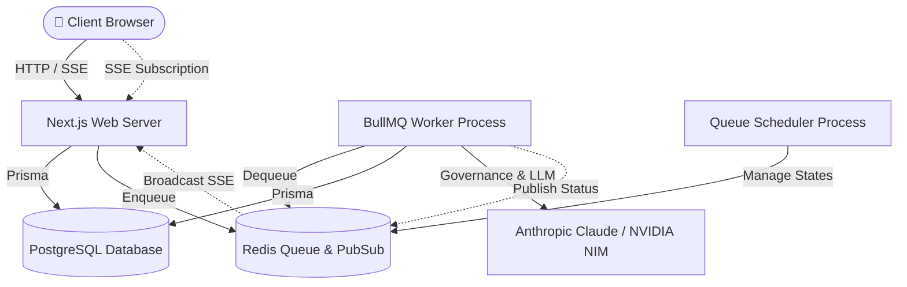

# Architecture Overview

This document defines the high-level system architecture, runtime topology, and AI agent coordination engine of the CareerPropel platform.

---

## 1. High-Level System Architecture



---

## 2. Runtime Topology

CareerPropel operates as three distinct backend processes connected to PostgreSQL and Redis:

1. **Next.js Web Server (`src/bin/web.ts`)**:
   - Manages client requests, page renders, and API routes.
   - Houses the SSE streaming gateway at `/api/agent/execution/[id]/subscribe` which multiplexes events from a shared Redis Pub/Sub subscriber.
2. **BullMQ Background Worker (`src/bin/worker.ts`)**:
   - Spawns one main `executionWorker` and 5 domain-specific sub-workers.
   - Dequeues and executes background agent tasks, enforcing concurrency and retry limits.
3. **Queue Scheduler (`src/bin/scheduler.ts`)**:
   - Runs the `QueueScheduler` to transition delayed jobs, clean up completed logs, and manage stalled tasks.

---

## 3. Autonomous Product Agent Architecture

The application contains 8 core product agents orchestrated via:

- **Stage Trigger Map (`src/lib/agents/stageTriggerMap.ts`)**: Deterministic triggers when job cards transition between pipeline stages (e.g., transitioning to `interested` triggers the `job-match` agent).
- **Planner Meta-Agent (`src/lib/agents/plannerPrompt.ts`)**: Evaluates candidate signals to suggest the next best action.
- **Critic Agent (`src/lib/agents/criticPrompt.ts`)**: Performs a secondary quality check on all agent outputs before they are persisted, grading them against minimum quality thresholds (e.g., 7/10 for `resume-tailor`).
- **Chain Executor (`src/lib/agents/chainExecutor.ts`)**: Enforces upstream dependencies (e.g., `interview-prep` requires `research` output first).

---

## 4. Cross-Cutting Governance Layer

All agent executions are wrapped in a mandatory governance stack located in `src/lib/governance/`:

```text
Request ➔ Policy Engine (Limit Check) ➔ Prompt Registry (Resolve Version) ➔ LLM Dispatch ➔ Output Validator (Zod + Semantic Rules) ➔ Hallucination Check ➔ Persist Output
```

- **Policy Engine (`policyEngine.ts`)**: Enforces concurrency, size, and cost limits.
- **Prompt Registry (`promptRegistry.ts`)**: Resolves active prompt versions and manages canary rollouts (e.g., 10% traffic splits).
- **Output Validator (`outputValidator.ts`)**: Checks JSON structure via Zod and applies semantic plausibility rules.
- **Hallucination Controls (`hallucinationControls.ts`)**: Detects prompt injection on inputs and checks outputs for fabricated data or PII leakage.
- **Bounded Execution (`boundedExecution.ts`)**: Limits recursion depth (max 3) and sets time-to-live boundaries (max 15 mins) to prevent infinite loops.

---

## 5. Real-Time Event Architecture

- **SSE Transport**: Server-Sent Events are the canonical transport for streaming execution progress. WebSocket paths are fully deprecated.
- **Shared Subscriber (`sharedSubscriber.ts`)**: Next.js processes use a single Redis subscriber client to avoid connection starvation under high concurrency.
- **Telemetry Event Replay (`replay.ts`)**: Supports recreating agent executions by replaying historical events.
