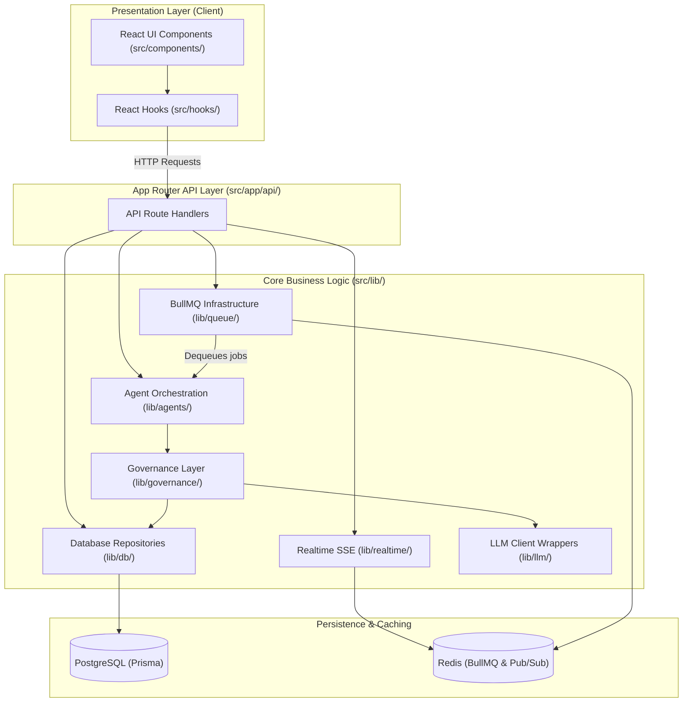

# Dependency Graph

This document represents the dependency hierarchy and service relationships within CareerPropel.

---

## 1. Architectural Layers & Relationships

---

## 2. Protected Hotspots & Boundaries

To prevent circular dependency hazards and architectural drift, the following import rules are enforced:

- **Database Client (`src/lib/db.ts`)**: Direct database access inside frontend components or hooks is prohibited. Only `src/lib/db/` repositories and background workers may import this client.
- **LLM Provider Client (`src/lib/llm/provider.ts`)**: Provider models must adhere to the `LLMProviderClient` interface (`src/lib/llm/types.ts`) to avoid circular imports.
- **SSE Manager (`src/lib/realtime/sse-manager.ts`)**: Exposes connection instrumentation solely to cypress/playwright tests. Gated tightly behind `process.env.NODE_ENV === 'test'`.
- **Redis Client (`src/lib/redis/index.ts`)**: Shared connection factory. API handlers must not instantiate custom client pools, avoiding port/connection exhaustion.
