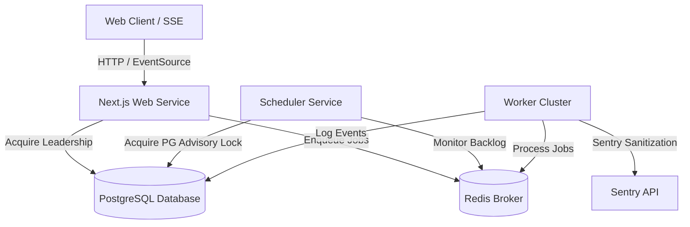

# Production-Like Environment Qualification Manual

This document details the configuration and verification strategies to qualify the CareerPropel platform in a simulated production environment.

## 1. Environment Topology

The qualification environment topology mirrors production architecture, running five concurrent services:



* **Web Service:** Next.js runtime handling user requests, API contracts, and Server-Sent Events (SSE).
* **Worker Service:** BullMQ cluster processing job execution partitions (`high-priority`, `standard`, `heavy`, `maintenance`).
* **Scheduler Service:** Single-node active process governed by a PostgreSQL Advisory Lock.
* **Redis Instance:** In-memory queue broker, heartbeat manager, and real-time pub/sub hub.
* **PostgreSQL Database:** Relational persistence for application data, immutable event ledgers, and transaction metrics.

---

## 2. Runtimes Qualification Strategy

### A. Deploy All Runtimes
To spin up the production-like local environment:
1. Ensure Docker is running.
2. Initialize services:
   ```bash
   docker-compose up -d
   ```
3. Run migrations and seed data:
   ```bash
   npm run db:push
   npm run db:seed
   ```
4. Start entrypoints in separate processes (or container replicas):
   * **Web:** `npm run start:web`
   * **Worker:** `npm run start:worker`
   * **Scheduler:** `npm run start:scheduler`

### B. Execute Synthetic Workloads
To verify queue continuity and worker concurrency:
1. Trigger 50+ concurrent mock executions using the scale simulation tooling:
   ```bash
   npx tsx src/lib/testing/load/load-simulation.ts --concurrency 50
   ```
2. Verify that jobs route correctly through the partitions:
   * **High-Priority:** fast job matching.
   * **Standard:** resume tailoring.
   * **Heavy:** long-running outreach generations.

### C. Fail Worker During Execution
To qualify worker self-recovery:
1. Enqueue standard executions.
2. Abruptly kill the worker process (`kill -9` or stopping the container) during an active execution.
3. Verify that the BullMQ job stalls, is caught by the `Scheduler` reconciliation sweep within 60s, and transitions cleanly back to `queued` or `failed` in the DB without orphan states.

### D. Fail Redis Temporarily
To qualify broker reconnect resilience:
1. Stop the Redis container:
   ```bash
   docker stop redis
   ```
2. Verify that Web, Worker, and Scheduler runtimes log connection loss but do not crash.
3. Restart the Redis container:
   ```bash
   docker start redis
   ```
4. Confirm that all runtimes reconnect automatically within 15 seconds, and resume processing active backlogs gracefully.

### E. Validate Replay & Recovery
1. Force an execution to fail to route it to the Dead-Letter Queue (DLQ).
2. Trigger an admin replay action for the failed execution ID.
3. Validate that:
   * The ledger appends a `EXECUTION_REPLAY` event.
   * A cryptographic signature chain hash is verified for integrity.
   * The job re-enters standard execution without duplicating the previous failed state.
