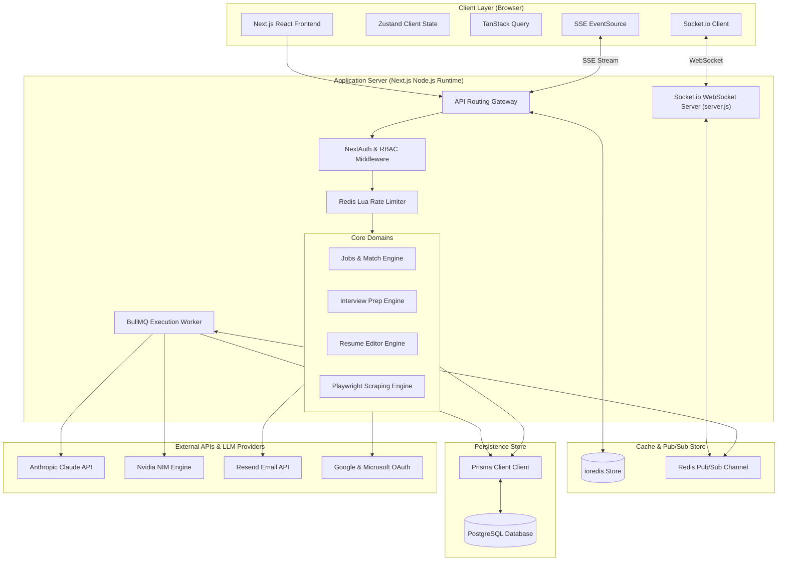
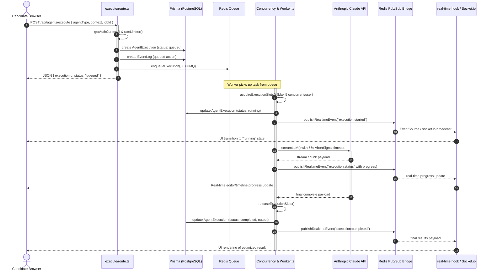
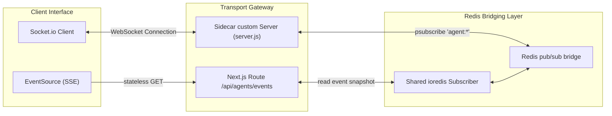

# Career Propel - Architecture Handbook

This document serves as the high-fidelity Architecture Handbook for **Career Propel**, mapping out the system topology, execution flows, real-time communications, and security scaffolding.

---

## 1. High-Level System Topology

Career Propel is a monolithic Next.js App Router application backed by a custom Node.js sidecar server (`server.js`) for persistent WebSocket (Socket.io) connections, utilizing Redis as an intermediary pub/sub bridge and PostgreSQL via Prisma ORM for data storage.

---

## 2. Agent Execution Flow (BullMQ Architecture)

The system leverages BullMQ on Redis for asynchronous, robust, and stateful agent execution with automatic concurrency gates, retry policies, and dead-letter queue (DLQ) support.

---

## 3. Dual-Transport Real-Time System

Career Propel provides robust real-time synchronization through a redundant dual-transport layer:
1. **WebSockets (Socket.io)**: Pinned to `server.js` for persistent TCP rooms, status pushes, and active typing feedback.
2. **Server-Sent Events (SSE)**: Built-in route `/api/agents/events` as a fallback transport running over stateless HTTP/2.

---

## 4. Encryption & Security Standards

To meet enterprise compliance guidelines, all candidate credentials and authentication integrations are hardened:
- **TOTP secrets**: AES-GCM encrypted in database.
- **Internal API Keys**: bcrypt-hashed with unique prefix indexing.
- **Google / Outlook OAuth Tokens**: AES-256-GCM encrypted at rest using the derived `CALENDAR_ENCRYPTION_KEY`.
