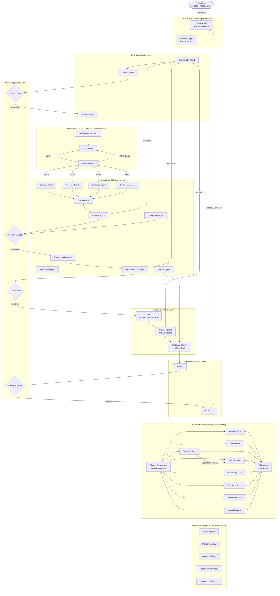
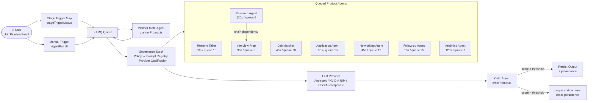
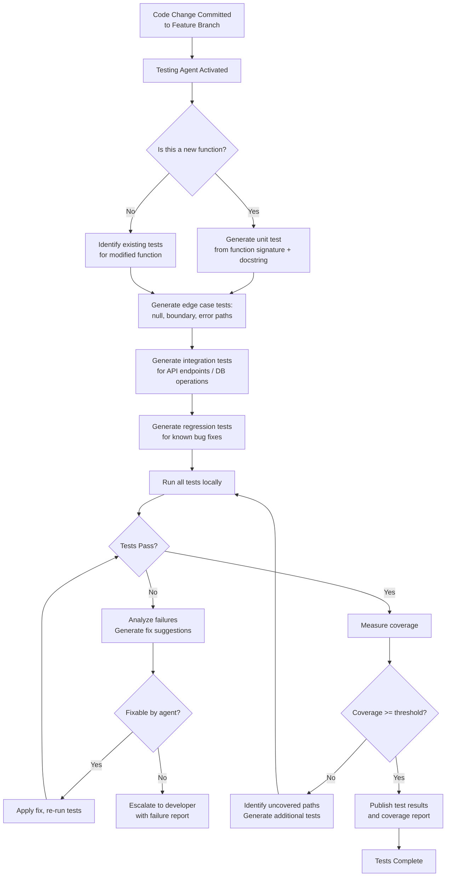

# AI-Assisted Development Workflow using Claude Code + Multi-Agent SDLC

**Document Type:** Engineering Handbook — Architecture Reference & Onboarding Guide  
**Audience:** Engineering team members, tech leads, platform engineers, AI/ML practitioners  
**Maintained by:** Engineering Platform Team  
**Status:** Canonical — supersedes all prior workflow documents  
**Revision Policy:** Update on each significant architecture change; PR required, tech lead approval mandatory

---

## Table of Contents

1. [Executive Overview](#1-executive-overview)
2. [Core Principles](#2-core-principles)
3. [High-Level Workflow Diagram](#3-high-level-workflow-diagram)
4. [End-to-End Instruction Lifecycle](#4-end-to-end-instruction-lifecycle)
5. [Agent Architecture](#5-agent-architecture)
   - 5.1 [SDLC Coordination Agents](#51-sdlc-coordination-agents)
   - 5.2 [Development Tooling Agents (Claude Code Subagents)](#52-development-tooling-agents-claude-code-subagents)
   - 5.3 [CareerPropel Product Agents](#53-careerpropel-product-agents)
   - 5.4 [Governance Layer (Cross-Cutting)](#54-governance-layer-cross-cutting)
6. [Context Engineering Workflow](#6-context-engineering-workflow)
7. [Prompt Engineering Workflow](#7-prompt-engineering-workflow)
8. [Development Lifecycle (Modern AI-Native SDLC)](#8-development-lifecycle-modern-ai-native-sdlc)
9. [Coding Workflow](#9-coding-workflow)
10. [Testing Workflow](#10-testing-workflow)
11. [Documentation Workflow](#11-documentation-workflow)
12. [Git & Branching Strategy](#12-git--branching-strategy)
13. [CI/CD Pipeline](#13-cicd-pipeline)
14. [Security & Governance](#14-security--governance)
15. [Observability & Telemetry](#15-observability--telemetry)
16. [Failure Handling & Recovery](#16-failure-handling--recovery)
17. [Definition of Done](#17-definition-of-done)
18. [Recommended Repository Structure](#18-recommended-repository-structure)
19. [Example Real-World Workflow](#19-example-real-world-workflow)
20. [Best Practices](#20-best-practices)
21. [Anti-Patterns](#21-anti-patterns)
22. [Future Enhancements](#22-future-enhancements)
23. [Conclusion](#23-conclusion)

---

## 1. Executive Overview

### What This Workflow Is

This document describes a **production-grade AI-assisted Software Development Lifecycle (SDLC)** operating inside Visual Studio Code using Claude Code as the primary AI interface. The workflow coordinates multiple specialized AI agents through a structured orchestration layer, enabling a single developer instruction to propagate across planning, architecture, code generation, testing, documentation, security validation, and deployment — with explicit human approval gates at each critical transition.

This is not an experimental prototype pattern. It is an **operational engineering model** designed for daily use by engineering teams building production systems. Every phase maps to a concrete deliverable, every agent has bounded responsibilities, and every automated step has a corresponding human checkpoint.

### Why Agentic SDLC Matters

Traditional development workflows place the cognitive load of context retention, dependency analysis, test generation, and documentation entirely on the developer. As systems grow in complexity, this creates bottlenecks, inconsistencies, and regressions.

An agentic SDLC distributes this cognitive work across specialized AI agents that:

- Retain full codebase context without fatigue
- Enforce coding conventions and patterns consistently
- Generate test cases from specifications and implementations simultaneously
- Identify security vulnerabilities before code is committed
- Maintain documentation in sync with code changes automatically
- Escalate to humans at well-defined decision boundaries

The result is a **multiplier on engineering velocity** without sacrificing quality, security, or auditability.

### Benefits Over Traditional Development

| Dimension | Traditional | AI-Assisted Agentic SDLC |
|---|---|---|
| Context retention | Developer memory / docs | Automated RAG + semantic retrieval |
| Code review coverage | Sampling-based | Systematic per-change analysis |
| Test generation | Manual, often deferred | Automated alongside implementation |
| Documentation | Frequently stale | Auto-synced with code changes |
| Security review | Post-development scan | Integrated at every lifecycle stage |
| Onboarding time | Weeks to months | Dramatically reduced via shared context |
| Consistency | Team-dependent | Enforced by agent policies |

### Role of Claude Code in VSCode

Claude Code operates as the **primary developer-facing AI interface** inside VSCode. It serves as:

- **Instruction receiver:** Parses natural-language developer instructions into structured tasks
- **Orchestration hub:** Routes tasks to appropriate specialized agents
- **Context manager:** Maintains working memory of the current task, relevant files, and conversation history
- **Inline assistant:** Provides real-time suggestions, explanations, and validations without leaving the editor
- **Approval interface:** Surfaces agent outputs, diffs, and decisions requiring human judgment

Claude Code communicates with the broader agent network through a structured message protocol. Each agent invocation is logged, traced, and auditable.

---

## 2. Core Principles

### Human-in-the-Loop Development

AI agents augment developer capability; they do not replace developer judgment. Every task that creates, modifies, or deletes production artifacts requires human review before finalization. Agents propose; humans approve. This is non-negotiable and enforced architecturally.

### AI-Assisted Engineering

The workflow treats AI as a first-class engineering tool, not an add-on. Agents participate from the earliest planning phase through post-deployment monitoring, providing continuous value rather than one-time code generation.

### Deterministic Workflows

Agent outputs must be reproducible within acceptable variance. Prompt templates are versioned, inputs are logged, and outputs are validated against schemas before use. Non-determinism is bounded and documented.

### Iterative Refinement

No task is expected to be perfect on the first pass. The workflow explicitly builds in self-critique loops, reviewer agent feedback, and human correction cycles. Iterations are tracked and contribute to prompt improvement.

### Shift-Left Testing

Tests are generated alongside (or before) implementation code. Security analysis begins at the planning phase. Documentation is written as code is merged, not afterward. Problems discovered late are expensive; this workflow makes early discovery the default.

### Security-First Engineering

Security analysis is not a final gate — it is woven throughout the lifecycle. The Security Agent participates in design review, code review, dependency analysis, and pre-deployment validation. Secret detection runs on every git operation.

### Documentation-as-Code

All documentation — API references, architecture decision records, changelogs, README files — is treated as a versioned code artifact. The Documentation Agent updates docs as part of the same PR that introduces code changes. Documentation drift is a build failure.

### Prompt Engineering Discipline

Prompts used to instruct agents are themselves versioned, tested, and governed. A poorly constructed prompt that produces incorrect agent behavior is treated as a defect. Prompt quality is measurable and tracked.

---

## 3. High-Level Workflow Diagram



> **Reading this diagram:** The top half shows the SDLC build pipeline. The bottom-right shows the product agents running in production after deployment. Governance (bottom-left) is a cross-cutting concern that wraps every product agent call.

**Separate product agent architecture diagram:**



---

## 4. End-to-End Instruction Lifecycle

The following describes, step by step, exactly what happens after a developer types an instruction inside VSCode with Claude Code active.

### Step 1 — Intent Analysis

**Trigger:** Developer types an instruction in the Claude Code panel.

Claude Code performs intent classification:
- Identifies whether the instruction is a bug fix, feature addition, refactoring, documentation update, infrastructure change, or investigation query
- Extracts named entities: file names, function names, service names, API endpoints, data models
- Identifies scope: single-file, module-level, cross-service, or system-wide
- Flags ambiguities and, if present, generates clarifying questions before proceeding

**Output:** A structured intent object — `{ type, scope, entities[], ambiguities[], priority }`

### Step 2 — Context Retrieval

The Context Engine performs multi-strategy retrieval:
- **Lexical search:** Exact matches for function names, class names, and identifiers
- **Semantic search:** Embedding-based similarity search across the codebase
- **Dependency graph traversal:** Identifies all files that import or are imported by the affected modules
- **Recent change history:** Retrieves the last N commits touching relevant files
- **Memory recall:** Loads prior task context, architectural decisions, and developer preferences from persistent memory

**Output:** A ranked context bundle — files, snippets, dependency maps, and history

### Step 3 — Requirement Decomposition

The Planner Agent receives the intent object and context bundle. It decomposes the instruction into atomic, verifiable subtasks:

- Each subtask has a clear input, expected output, and acceptance criterion
- Dependencies between subtasks are mapped (subtask B cannot begin until subtask A is complete)
- Subtasks are tagged by type: `code`, `test`, `docs`, `infra`, `security`, `review`
- Estimated complexity is assigned (low / medium / high) to support prioritization

**Output:** A structured task graph with dependencies, types, and complexity estimates

### Step 4 — Agent Selection

The Orchestrator Agent receives the task graph and selects appropriate agents:
- Each subtask is routed to the agent whose specialization matches the task type
- Load balancing rules apply when multiple agents can handle a task
- Agents that are unavailable or in failure state are bypassed with escalation

**Output:** Task assignments — a mapping of `{ subtask → agent }` for all items in the task graph

### Step 5 — Task Orchestration

The Orchestrator Agent manages execution order:
- Independent subtasks execute in parallel where agent capacity permits
- Dependent subtasks execute sequentially, with output of one becoming input of the next
- A shared context bus is maintained so all agents have access to the latest shared state
- Timeouts are enforced per agent call; failures trigger the failure handling protocol

### Step 6 — Planning Phase

The Architect Agent produces a design document for non-trivial tasks:
- Identifies affected system components
- Proposes the implementation approach
- Documents interface contracts (API signatures, data schemas, event shapes)
- Flags backward compatibility concerns
- Identifies infrastructure changes required

**Human Gate:** The developer reviews and approves the plan before any code is generated. Plan approval is explicit — Claude Code surfaces the document and requires a thumbs-up or revision request.

### Step 7 — Code Generation

Specialized agents (Backend, Frontend, Database, Infrastructure) generate code according to the approved plan:
- Code is generated file by file, with explicit before/after diffs shown
- Each generated file is validated for syntax correctness before being written
- Pattern consistency is enforced by comparing generated code against existing conventions in the codebase
- No file is overwritten without showing the developer the diff

**Output:** Proposed code changes staged in a working branch

### Step 8 — Validation (Agent Self-Review)

The Refactoring Agent and Reviewer/Critic Agent analyze the generated code:
- The Critic Agent performs multi-pass review: correctness, consistency, clarity, and performance
- The Refactoring Agent identifies opportunities to simplify without changing behavior
- Self-critique results are fed back to the generating agent for a revision pass
- A maximum of three revision cycles is enforced to prevent infinite loops

### Step 9 — Testing

The Testing Agent generates and executes tests:
- Unit tests are generated for every new function and modified function
- Integration tests are generated for every new API endpoint or data access pattern
- Edge cases are explicitly tested: null inputs, boundary conditions, error paths
- Tests are executed locally before any CI pipeline is triggered
- Coverage thresholds are enforced: minimum 80% line coverage for new code

**Output:** Test suite with results report; failures block progression

### Step 10 — Documentation Updates

The Documentation Agent runs in parallel with the testing phase:
- Inline JSDoc / TSDoc comments are added to all new/modified functions
- API documentation is regenerated if any endpoint signatures changed
- The changelog is updated with a human-readable entry describing the change
- Architecture documents are updated if any structural decisions were made
- README files in affected modules are synchronized

### Step 11 — Security Scanning

The Security Agent runs a multi-layer scan:
- **Secret detection:** Scans all changed files for API keys, tokens, passwords, connection strings
- **Dependency audit:** Checks all `package.json` / `requirements.txt` / `go.mod` changes for known CVEs
- **Static analysis:** Runs security-focused linting rules (injection, XSS, insecure deserialization)
- **Prompt injection analysis:** For AI-enabled features, scans for prompt injection surfaces
- **SBOM generation:** Produces a Software Bill of Materials for the changed dependency tree

**Human Gate:** Any high-severity finding blocks progression. The Security Agent produces a report; the developer must explicitly acknowledge or remediate each finding.

### Step 12 — Git Changes

The Release Agent prepares the version control artifacts:
- A feature branch is created following the naming convention (`feat/`, `fix/`, `chore/`)
- Commits are created per logical unit of work, following Conventional Commits format
- Commit messages include a short description, the task reference, and the co-authored-by attribution
- A pull request is opened with a structured description: summary, motivation, changes, test evidence, and risk assessment

### Step 13 — CI/CD Execution

The CI pipeline executes automatically on PR creation:
- Full test suite runs in an isolated environment
- Build artifacts are produced and validated
- Container images are built and scanned for OS-level vulnerabilities
- Static analysis and linting are enforced as build gates
- Coverage reports are published to the PR

### Step 14 — Human Review

**Human Gate:** The developer (and optionally a peer reviewer) reviews the complete PR:
- Code diff is presented with agent annotations explaining each change
- Test results and coverage delta are visible inline
- Security scan results are attached to the PR
- The Reviewer/Critic Agent summary is presented as a PR comment

The developer may request changes, which re-triggers the relevant agents, or approve the PR for merge.

### Step 15 — Merge & Deployment

Upon approval:
- PR is squash-merged to main following the defined branching strategy
- A deployment pipeline is triggered for the staging environment
- Smoke tests and synthetic monitoring run against staging
- **Human Gate:** Deployment to production requires explicit approval from an authorized team member
- Post-deployment monitoring runs for a defined observation window before the task is marked complete

---

## 5. Agent Architecture

The CareerPropel agentic system operates across **three distinct layers**, each with a different scope and lifecycle. Understanding the separation is critical to reasoning about blast radius, change risk, and correct SDLC routing.

| Layer | Agents | Scope |
|---|---|---|
| **SDLC Coordination** | Orchestrator, Planner, Architect, Backend, Frontend, Database, Infrastructure, Security, Testing, Documentation, Refactoring, Reviewer/Critic, Compliance, Release | Development workflow; manage how code gets built and shipped |
| **Development Tooling** | code-builder, code-validator, validation-orchestrator | Claude Code subagents; automated build-validate loops inside the IDE |
| **Product Agents** | 8 career agents + 2 meta-agents + 10 AI feature services | Application runtime; deliver AI-powered career assistance to end users |

Each agent has a clearly bounded scope of responsibility. Agents do not share implementation logic — they communicate only through structured inputs and outputs. This boundary enforcement prevents responsibility bleed and makes the system debuggable.

---

## 5.1 SDLC Coordination Agents

The following agents coordinate the software development lifecycle. They plan, build, validate, document, and ship the CareerPropel product agents described in §5.3.

### Orchestrator Agent

**Responsibilities:** Receives decomposed task graphs from the Planner. Assigns tasks to specialized agents. Manages parallel and sequential execution. Aggregates outputs. Handles agent failures.

**Inputs:** Task graph, agent availability state, context bundle  
**Outputs:** Execution state log, aggregated agent outputs, escalation events  
**Failure condition:** If more than 2 agents fail in the same task graph, halt and escalate to developer  
**Escalation rule:** Pause execution, surface failure report, request developer guidance before resuming

---

### Planner Agent

**Responsibilities:** Decomposes developer instructions into atomic, verifiable subtasks. Maps dependencies. Assigns task types and complexity estimates. Produces the task graph consumed by the Orchestrator.

**Inputs:** Intent object, context bundle, architectural constraints  
**Outputs:** Task graph with `{ id, type, description, inputs, expectedOutput, dependencies[], complexity }`  
**Failure condition:** If instruction cannot be safely decomposed (ambiguity too high), return clarifying questions  
**Escalation rule:** Do not guess intent; surface ambiguity explicitly

---

### Architect Agent

**Responsibilities:** Produces design documents for non-trivial tasks. Defines interface contracts. Identifies affected components. Documents backward compatibility risks. Specifies infrastructure requirements.

**Inputs:** Task graph, existing architecture docs, current codebase state  
**Outputs:** Design document (Markdown), interface contracts (TypeScript types / OpenAPI schemas), risk register  
**Failure condition:** If proposed design contradicts existing architecture decisions, surface conflict for human resolution  
**Escalation rule:** Never override an existing ADR silently — flag it for developer review

---

### Backend Agent

**Responsibilities:** Generates server-side code including API handlers, business logic, service classes, data access objects, middleware, and configuration.

**Inputs:** Approved design document, existing backend conventions, affected file list  
**Outputs:** Code diffs, new files, modified files  
**Failure condition:** If generated code fails syntax validation or type checking, retry once; escalate on second failure  
**Escalation rule:** Never write to files outside the declared scope

---

### Frontend Agent

**Responsibilities:** Generates UI components, pages, hooks, state management logic, and frontend API integration code.

**Inputs:** Approved design document, UI component conventions, design system tokens  
**Outputs:** Component files, page files, hook files, test stubs  
**Failure condition:** If required design system component does not exist, raise a task to the Documentation Agent and halt  
**Escalation rule:** Do not improvise design system extensions without Architect Agent review

---

### Database Agent

**Responsibilities:** Generates database migrations, schema changes, query optimizations, seed data, and ORM model updates.

**Inputs:** Approved design document, existing schema, migration history  
**Outputs:** Migration files, updated model files, query analysis report  
**Failure condition:** If a migration would cause irreversible data loss, halt and escalate  
**Escalation rule:** All destructive schema changes require explicit developer approval with a written rollback plan

---

### Infrastructure Agent

**Responsibilities:** Generates and validates Infrastructure as Code (IaC) — Terraform, Kubernetes manifests, Docker files, environment configuration, and secrets management.

**Inputs:** Approved design document, existing IaC state, environment specifications  
**Outputs:** IaC diffs, environment configuration files, deployment manifests  
**Failure condition:** If generated IaC references resources that don't exist in the target environment, halt and report  
**Escalation rule:** Never apply IaC changes directly — output only; human or CI pipeline applies changes

---

### Security Agent

**Responsibilities:** Scans code, dependencies, and configuration for security vulnerabilities. Validates prompt injection surfaces. Enforces secret hygiene. Produces SBOM. Flags compliance violations.

**Inputs:** Changed files, dependency manifests, security policy definitions  
**Outputs:** Security report, CVE list, SBOM, secret detection results, remediation recommendations  
**Failure condition:** Critical/high severity findings block progression; medium findings generate warnings  
**Escalation rule:** Never suppress a finding silently; all findings are logged and reported

---

### Testing Agent

**Responsibilities:** Generates unit, integration, E2E, contract, and regression tests. Executes tests locally. Enforces coverage thresholds. Reports results.

**Inputs:** Code changes, existing test patterns, coverage requirements, test data fixtures  
**Outputs:** Test files, test results report, coverage report  
**Failure condition:** Any test failure blocks pipeline progression  
**Escalation rule:** If coverage drops below threshold, report the gap and suggest specific additional tests

---

### Documentation Agent

**Responsibilities:** Generates and updates inline code comments, API documentation, architecture docs, changelogs, and README files. Ensures documentation stays synchronized with code changes.

**Inputs:** Code changes, existing documentation, changelog format conventions  
**Outputs:** Updated documentation files, changelog entries, API reference diffs  
**Failure condition:** If documentation cannot be automatically generated (ambiguous intent), create a stub and flag for human completion  
**Escalation rule:** Documentation staleness is a build failure — never skip documentation updates for code changes

---

### Refactoring Agent

**Responsibilities:** Analyzes generated and existing code for improvement opportunities. Suggests and applies simplifications. Enforces code style and consistency. Does not change observable behavior.

**Inputs:** Generated code, existing code patterns, style guide  
**Outputs:** Refactoring suggestions, revised code diffs  
**Failure condition:** If refactoring would change observable behavior, halt and surface the concern  
**Escalation rule:** All refactoring suggestions are presented as diffs — developer approves before application

---

### Reviewer/Critic Agent

**Responsibilities:** Performs structured multi-pass code review. Evaluates correctness, consistency, performance, readability, and maintainability. Produces a prioritized finding list.

**Inputs:** Code changes, design document, test results  
**Outputs:** Review report with `{ severity, finding, file, line, suggestion }`  
**Failure condition:** If a critical correctness issue is found, block PR merge  
**Escalation rule:** All critical findings must be resolved before progression; major findings require developer acknowledgment

---

### Compliance Agent

**Responsibilities:** Validates changes against defined engineering policies, regulatory requirements (e.g., GDPR, SOC 2), internal standards, and dependency license restrictions.

**Inputs:** Code changes, dependency manifest, policy definitions  
**Outputs:** Compliance report, license audit, policy violation list  
**Failure condition:** Any policy violation blocks deployment  
**Escalation rule:** Compliance violations are escalated to the tech lead and logged in the audit trail

---

### Release Agent

**Responsibilities:** Manages version tagging, changelog finalization, artifact publishing, and deployment pipeline triggering. Coordinates with CI/CD.

**Inputs:** Approved PR, version strategy, deployment configuration  
**Outputs:** Git tags, release notes, deployment trigger events  
**Failure condition:** If CI pipeline fails, halt release and report  
**Escalation rule:** Never tag a release without a green CI pipeline and explicit human approval

---

## 5.2 Development Tooling Agents (Claude Code Subagents)

Three agents are configured in `.claude/agents/` and operate exclusively within the development workflow. They are invoked by the validation-orchestrator, which coordinates their interaction in a strict builder-then-validator loop.

| Agent | File | Role | Model | Max Turns |
|---|---|---|---|---|
| **code-builder** | `.claude/agents/code-builder.md` | Writes and updates implementation code; feature work, bug fixes, refactors, test updates | Sonnet | 20 |
| **code-validator** | `.claude/agents/code-validator.md` | Read-only; verifies correctness, completeness, regressions, requirement coverage. **Cannot modify files.** | Sonnet | 12 |
| **validation-orchestrator** | `.claude/agents/validation-orchestrator.md` | Coordinates builder → validator loop; iterates until PASS or hard stop | Sonnet | 8 |

**Loop protocol:**

```text
validation-orchestrator
  → code-builder (implements)
  → code-validator (validates; returns PASS or FAIL with findings)
  → [FAIL] → code-builder (applies findings verbatim)
  → code-validator (re-validates)
  → repeat until PASS or maxTurns reached
```

`code-builder` triggers post-edit hooks on every file write (`validate-after-edit.sh`) and before stopping (`validate-before-stop.sh`), enforcing lint, typecheck, and test gates inline. It will not claim success unless these checks pass.

---

## 5.3 CareerPropel Product Agents

These are the AI agents embedded in the CareerPropel application itself. They are the **deliverables** of the SDLC — the agents being built, not the agents doing the building. Every code change that touches these agents passes through the full SDLC lifecycle described in §8.

### Core Career Agents

Eight agents are registered in `src/types/agent-configs.ts` (configuration) and `src/types/agent.ts` (type definitions). All run as BullMQ queue workers, use Claude as the primary LLM, and are governed by the policy engine, prompt registry, output validator, and hallucination controls in `src/lib/governance/`.

| Agent | Type Key | Description | Timeout | Queue Depth | Category |
|---|---|---|---|---|---|
| **Resume Tailor** | `resume-tailor` | Tailors resume bullet points, skills, and summary for a specific job description; matches language, quantifies impact | 60 s | 10 | Automation |
| **Job Matcher** | `job-match` | Scores job-candidate alignment across skill match, experience, compensation fit, culture fit, and growth opportunity (0–100 per dimension) | 45 s | 20 | Automation |
| **Application Agent** | `application` | Handles automated job application submissions | 30 s | 15 | Automation |
| **Research Agent** | `research` | Synthesizes company intelligence: leadership, culture, competitive position, growth trajectory, red flags, recent news | 120 s | 5 | Analysis |
| **Interview Prep** | `interview-prep` | Generates STAR stories, technical topic deep-dives, company-specific talking points, negotiation frameworks, likely question list | 90 s | 8 | Communication |
| **Networking Agent** | `networking` | Identifies and prioritizes warm/cold outreach targets; generates conversation starters and value propositions per contact | 45 s | 12 | Communication |
| **Follow-up Agent** | `follow-up` | Crafts personalized post-interview follow-up emails; produces a sequenced 2–3 step follow-up plan with CTAs | 15 s | 25 | Communication |
| **Analytics Agent** | `analytics` | Computes career pipeline metrics, longitudinal performance trends, and career health scores | 120 s | 3 | Analysis |

**Retry policy (all agents):** exponential backoff; `resume-tailor`, `job-match`, `interview-prep`, `networking` → 3 attempts; `application` → 5 attempts; `research`, `analytics` → 2 attempts.

### Meta / Coordination Agents

Two internal agents coordinate planning and quality gating. They are not directly user-invocable but run automatically within the execution pipeline.

| Agent | File | Role |
|---|---|---|
| **Planner Agent** | `src/lib/agents/plannerPrompt.ts` | Career strategy AI: given job context, current stage, and readiness signals (has resume, has research, has interview prep, days since activity, days to interview), recommends the highest-value next agent action. Uses a deterministic stage-trigger map (`stageTriggerMap.ts`) as the primary source and LLM reasoning as override/enrichment. |
| **Critic Agent** | `src/lib/agents/criticPrompt.ts` | Quality-control gate: runs a second LLM pass on every agent output before persistence, scoring 0–10 against per-agent minimum thresholds. Outputs below threshold are rejected and logged as `failureClassification='validation_error'`. |

**Critic thresholds by agent type:**

| Agent | Minimum Acceptable Score |
|---|---|
| resume-tailor | 7 / 10 |
| interview-prep | 7 / 10 |
| follow-up | 7 / 10 |
| job-match | 6 / 10 |
| research | 6 / 10 |
| networking | 6 / 10 |

### Stage-Trigger Map

Agents fire automatically when a job card transitions into a pipeline stage (`src/lib/agents/stageTriggerMap.ts`). This is the primary deterministic routing layer, used by both the Planner Agent and the queue worker.

| Pipeline Stage | Auto-Triggered Agent |
|---|---|
| `interested` | Job Matcher |
| `resume_tailoring` | Resume Tailor |
| `recruiter_screen` | Research Agent |
| `hiring_manager` | Research Agent |
| `technical_interview` | Interview Prep |
| `system_design` | Interview Prep |
| `behavioral` | Interview Prep |
| `final_round` | Interview Prep |
| `sourced`, `applied`, `offer`, `negotiation`, `rejected`, `archived` | *(none — manual trigger only)* |

### Agent Dependency Chain

`interview-prep` has a declared upstream dependency on `research` (`src/lib/agents/chainExecutor.ts`). When `interview-prep` is triggered, the chain executor checks for a completed `research` execution for the same job. If found, the research output is merged into the interview-prep context before dispatch.

```text
research
  → cultureSummary, competitivePosition, redFlags, recentNews
          ↓ merged as companyInfo string
    interview-prep (receives enriched context)
```

If `research` has not yet completed, `interview-prep` is deferred until the dependency is satisfied. `AGENT_DEPENDENCIES` in `chainExecutor.ts` is the authoritative dependency registry — extend it there when adding new chaining rules.

### AI-Powered Feature Services

Beyond the queued agents, CareerPropel includes AI-powered feature services that execute as direct synchronous API calls (no queue, no retry policy, no Critic gate). These are single-call AI features integrated directly into API routes.

| Service | Route / File | Description |
|---|---|---|
| **ATS Scorer** | `/api/profile/ats-check` | Keyword gap analysis and ATS compatibility scoring against a job description |
| **Career Narrative Generator** | `/api/profile/narrative` | AI-generated career summary and professional narrative |
| **Mock Interview Engine** | `/api/interview-prep/mock` | Generates mock interview questions tailored to a specific role and company |
| **Mock Interview Feedback** | `/api/interview-prep/mock/feedback` | Evaluates a candidate's mock interview response with structured, actionable feedback |
| **Job Match Scorer** | `src/lib/jobs/matchScorer.ts` | Claude-powered job-profile scoring; persists `matchScore` on the Job record |
| **Document Generator** | `src/lib/document/generator.ts` | AI-assisted resume and cover letter generation |
| **Interview Prep Refinement** | `src/lib/interviews/prepRefinementService.ts` | Refines and improves existing interview prep materials |
| **Recommendations Engine** | `src/lib/analytics/recommendations-engine.ts` | AI-driven career action recommendations based on pipeline state |
| **Profile Quantifier** | `/api/profile/quantify` | Quantifies career accomplishments with metrics and impact framing |
| **Skill Gap Analyzer** | `/api/profile/skill-gaps` | Identifies skill gaps relative to target roles and generates a learning path |

### LLM Provider Layer

All agents and services route through a unified provider abstraction (`src/lib/llm/provider.ts`, `src/lib/llm/orchestrator.ts`):

- **Primary:** Anthropic Claude — Sonnet for quality-critical tasks (resume tailoring, interview prep, research), Haiku for classification tasks
- **Secondary:** NVIDIA NIM (`src/lib/llm/nvidia-nim.ts`)
- **Generic OpenAI-compatible adapter:** Groq, OpenRouter, DeepSeek, Ollama, LM Studio (`src/lib/llm/orchestrator.ts`)
- **Fallback chain:** Claude API → heuristic / rule-based → graceful error surfaced to user
- **BYOK support:** Users may supply their own Anthropic API key via Settings → AI Providers; stored encrypted at rest (AES-256-CBC, `AI_MASTER_SECRET`)

**Model routing policy:**

| Use Case | Model |
|---|---|
| Interview prep, resume tailoring, research, narrative generation | `claude-sonnet-4-6` |
| ATS analysis, mock interview feedback | `claude-sonnet-4-6` |
| Simple classification tasks | `claude-haiku-4-5` |

---

## 5.4 Governance Layer (Cross-Cutting)

Every agent execution — whether a queued product agent or a direct feature service call — passes through a shared governance stack enforced by `src/lib/governance/`. This layer is transparent to callers but mandatory.

| Component | File | Responsibility |
|---|---|---|
| **Policy Engine** | `policyEngine.ts` | Per-agent concurrency limits, input size limits, cost estimation; blocks execution on policy violation before any LLM call is made |
| **Prompt Registry** | `promptRegistry.ts` | Versioned prompt resolution; records `promptVersionId`, `promptHash`, and `sanitizerVersion` on every execution record |
| **Output Validator** | `outputValidator.ts` | Three-layer validation: schema (JSON structure), semantic (required field presence), policy (content rules); normalizes output before persistence |
| **Hallucination Controls** | `hallucinationControls.ts` | Prompt injection detection on input; hallucination risk inspection on output; configurable `blockOnHallucinationRisk` per agent policy |
| **Provider Qualification** | `providerQualification.ts` | Asserts that the active LLM provider + model is qualified for the given agent type before dispatching; fails fast before LLM call |
| **Bounded Execution** | `boundedExecution.ts` | Execution isolation, recursion depth limits (max depth 3 for nested orchestration), TTL enforcement (30 min max per plan), token budget per step |
| **Multi-Agent Coordination** | `multiAgentCoordination.ts` | Orchestration plan validation (max 10 steps, no duplicate step IDs, budget feasibility), step-level context isolation, canary routing (deterministic hash-based rollout) |

**Execution governance flow (per agent call):**

```text
1. Policy check (concurrency + input size)
2. Prompt injection inspection on input
3. Provider qualification assertion
4. Prompt version resolution from registry
5. LLM dispatch
6. Output schema + semantic + policy validation
7. Hallucination risk inspection
8. Cost estimation recorded
9. Persist result with full provenance (provider, model, promptVersionId, promptHash, validationVersion)
```

---

## 6. Context Engineering Workflow

### Why Context Quality Matters

The quality of agent output is directly proportional to the quality of the context provided. A context bundle that is too broad wastes token capacity and introduces noise. A bundle that is too narrow causes agents to make incorrect assumptions about the codebase.

### Context Assembly Pipeline

```
Developer Instruction
        │
        ▼
┌─────────────────────────┐
│  1. Lexical Search      │ ← Exact symbol/identifier matches
│  2. Semantic Search     │ ← Embedding similarity (top-K files)
│  3. Dependency Tracer   │ ← Import/export graph traversal
│  4. Git History         │ ← Recent commits on relevant files
│  5. Architecture Docs   │ ← ADRs, design docs, API specs
│  6. Memory Recall       │ ← Prior task context, preferences
└─────────────────────────┘
        │
        ▼
  Ranked Context Bundle
  (Priority-scored, deduped)
        │
        ▼
  Context Window Packing
  (Stay within model limits)
        │
        ▼
  Agent Context Payload
```

### Embedding Strategy

- All source files are embedded using a code-optimized embedding model at repository initialization and incrementally as files change
- Embedding index is updated on every `git commit` via a post-commit hook
- Embeddings capture semantic meaning at function, class, and file level
- At query time, the top-K most relevant chunks are retrieved using cosine similarity

### File Prioritization Rules

| Priority | Criteria |
|---|---|
| Critical | Files directly named in the instruction |
| High | Files that import or export the named entities |
| High | Files changed in the last 5 commits for the same module |
| Medium | Files with semantic similarity > 0.85 to the instruction |
| Low | Files with semantic similarity 0.70–0.85 |
| Excluded | Test files, auto-generated files (unless explicitly requested) |

### Context Window Management

- Total context is capped at model limits with a safety margin reserved for agent output
- When context exceeds budget, lower-priority items are truncated
- Truncation is logged and surfaced so developers know when context is incomplete
- Critical files are never truncated; they are split into chunks and retrieved across multiple agent calls if necessary

### Memory Management

- Task-level memory: maintained for the duration of a single developer instruction
- Session-level memory: persists across instructions in a single VSCode session
- Project-level memory: stored in a persistent memory file indexed by MEMORY.md
- Memory items are tagged with type (`user`, `feedback`, `project`, `reference`) and expire based on relevance scoring

---

## 7. Prompt Engineering Workflow

### Task Decomposition

Every developer instruction is decomposed into a structured prompt hierarchy before being dispatched to agents. This prevents agents from receiving ambiguous or overloaded instructions.

**Decomposition levels:**
1. **Intent layer:** What the developer wants to achieve (goal)
2. **Strategy layer:** How the system plans to achieve it (approach)
3. **Execution layer:** Specific instructions to each agent (task)
4. **Validation layer:** How to verify the result is correct (acceptance criteria)

### Chain-of-Thought Style Planning

For complex tasks, the Planner Agent uses explicit reasoning steps before producing output:

```
STEP 1: Restate the goal in my own words
STEP 2: Identify what I know about the current state
STEP 3: Identify what is unknown or ambiguous
STEP 4: List the subtasks in dependency order
STEP 5: Assign each subtask a type and complexity
STEP 6: Identify risks and edge cases
STEP 7: Produce the task graph
```

This reasoning is logged and available for developer inspection when debugging unexpected agent behavior.

### Self-Critique Loop

After an agent produces output, a structured self-critique pass is triggered:

1. **Correctness check:** Does the output satisfy the acceptance criteria?
2. **Completeness check:** Are there missing pieces?
3. **Consistency check:** Does the output follow existing patterns?
4. **Risk check:** Does the output introduce unintended side effects?

If the self-critique identifies issues, the agent revises its output and re-runs the critique. Maximum three revision cycles per agent call.

### Prompt Templates

All agent system prompts are stored in `/prompts/agents/`. Each template includes:

- **Role definition:** Who the agent is and what it is responsible for
- **Behavioral constraints:** What the agent must never do
- **Output format:** Exact schema for structured outputs
- **Examples:** Few-shot examples for the most common task types
- **Escalation instructions:** When and how to signal that human input is needed

### Prompt Versioning

- Prompts are versioned using semantic versioning (e.g., `v1.2.0`)
- Each agent records the prompt version used in its output metadata
- Prompt changes require a PR and tech lead review
- A/B testing of prompt variants is supported with rollout controls

### Prompt Validation

- Prompts are validated against a schema before deployment
- Required fields: role, constraints, outputFormat, escalationRules
- Prompt regression tests verify agent behavior on a fixed benchmark dataset after any prompt change

### Prompt Observability

- Every agent call logs: prompt version, input token count, output token count, latency, success/failure
- Prompt traces are stored and queryable for debugging and improvement
- Token costs are tracked per prompt version and aggregated by task type

---

## 8. Development Lifecycle (Modern AI-Native SDLC)

### Phase 1 — Discovery

| Role | Activity |
|---|---|
| **Human** | Identifies the need; writes a brief instruction or user story |
| **AI (Claude Code)** | Performs intent analysis; retrieves relevant context; identifies ambiguities |
| **Deliverable** | Intent object, clarifying questions (if needed), scope estimate |
| **Validation Gate** | Developer confirms scope and intent before planning begins |

### Phase 2 — Planning

| Role | Activity |
|---|---|
| **Human** | Reviews and approves the task graph |
| **AI (Planner Agent)** | Decomposes instruction into atomic subtasks; maps dependencies; estimates complexity |
| **Deliverable** | Approved task graph with assignments |
| **Validation Gate** | Human explicit approval required; no code generated without approved plan |

### Phase 3 — Design

| Role | Activity |
|---|---|
| **Human** | Reviews and approves the design document |
| **AI (Architect Agent)** | Produces design document; defines interfaces; identifies risks |
| **Deliverable** | Design document, interface contracts, risk register |
| **Validation Gate** | Human approval required for any architectural change |

### Phase 4 — Implementation

| Role | Activity |
|---|---|
| **Human** | Reviews generated code diffs; requests changes if needed |
| **AI (Backend, Frontend, Database, Infrastructure Agents)** | Generates code per approved design; writes to feature branch |
| **AI (validation-orchestrator → code-builder → code-validator)** | Runs builder-validator loop on generated code; iterates until PASS or hard stop; post-edit hooks enforce lint + typecheck + tests inline |
| **Deliverable** | Proposed code changes staged on feature branch, validated by code-validator (PASS verdict) |
| **Validation Gate** | Diff review by developer; syntax/type checking must pass; code-validator PASS required |

### Phase 5 — Testing

| Role | Activity |
|---|---|
| **Human** | Reviews test coverage report; approves if thresholds met |
| **AI (Testing Agent)** | Generates and executes unit, integration, and regression tests |
| **Deliverable** | Test suite, results report, coverage report |
| **Validation Gate** | All tests pass; coverage thresholds met |

### Phase 6 — Security Validation

| Role | Activity |
|---|---|
| **Human** | Acknowledges or remediates all security findings |
| **AI (Security Agent, Compliance Agent)** | Runs secret detection, dependency audit, static analysis, compliance check |
| **Deliverable** | Security report, SBOM, compliance report |
| **Validation Gate** | No critical/high findings unaddressed; developer sign-off required |

### Phase 7 — Documentation

| Role | Activity |
|---|---|
| **Human** | Reviews documentation changes; ensures accuracy |
| **AI (Documentation Agent)** | Updates inline comments, API docs, changelog, README |
| **Deliverable** | Updated documentation files as part of the same PR |
| **Validation Gate** | Documentation diff reviewed alongside code diff |

### Phase 8 — Review

| Role | Activity |
|---|---|
| **Human** | Performs final PR review; requests changes or approves |
| **AI (Reviewer/Critic Agent)** | Produces prioritized finding report; annotates PR |
| **Deliverable** | PR approval, resolved findings |
| **Validation Gate** | All critical findings resolved; PR approval from authorized reviewer |

### Phase 9 — Release

| Role | Activity |
|---|---|
| **Human** | Approves deployment to staging and production |
| **AI (Release Agent)** | Tags version, finalizes changelog, triggers deployment |
| **Deliverable** | Git tag, release notes, deployment pipeline run |
| **Validation Gate** | CI green; staging smoke tests pass; human approval for production |

### Phase 10 — Monitoring

| Role | Activity |
|---|---|
| **Human** | Monitors dashboards; responds to alerts |
| **AI** | Analyzes post-deployment metrics; correlates errors with recent changes |
| **Deliverable** | Monitoring report, alert summaries |
| **Validation Gate** | Observation window completes without elevated error rate |

### Phase 11 — Continuous Improvement

| Role | Activity |
|---|---|
| **Human** | Reviews improvement suggestions; prioritizes prompt and workflow updates |
| **AI** | Aggregates task outcomes; identifies recurring failure patterns; suggests process improvements |
| **Deliverable** | Improvement backlog, updated prompt templates, refined workflow documentation |
| **Validation Gate** | Improvement changes reviewed and approved before deployment |

---

## 9. Coding Workflow

### File Discovery

Before writing any code, the Backend/Frontend/Database agents enumerate all files that will be affected:

1. Identify files directly named in the design document
2. Traverse import/export graph to find dependents and dependencies
3. Cross-reference with the git change history for the same task type
4. Produce an ordered modification list with rationale for each file

### Impact Analysis

For each file in the modification list:
- Identify all callers of functions that will be modified
- Identify all tests that exercise the affected code paths
- Flag any public API surfaces that, if changed, would break consumers
- Estimate the risk level: low (internal only), medium (module boundary), high (public API / external contract)

### Safe Code Modification

- Agents never perform in-place string replacement without understanding the full function context
- Every code change is produced as a complete, valid version of the file (or function block), not a patch
- Type-checking is run after every file modification before proceeding to the next file
- If type errors are introduced, the agent backtracks and revises the change

### Pattern Consistency

- Before generating code, the agent reads 3–5 representative existing files in the same module
- Generated code follows the same naming conventions, file structure, error handling patterns, and logging patterns
- Style guide rules are enforced via linting as a post-generation step

### Refactoring Strategy

- Refactoring is always behavior-preserving — it never changes observable outputs
- Refactoring is performed in a separate commit from functional changes to enable isolated review
- The Refactoring Agent documents the rationale for each change

### Backward Compatibility

- Any change to an existing function signature, API endpoint, or data schema triggers a backward compatibility analysis
- Deprecated items are flagged with JSDoc `@deprecated` annotations and a migration path
- Breaking changes require a major version bump and a migration guide in the documentation

---

## 10. Testing Workflow



### Test Types and Scope

| Test Type | Scope | When Generated | Coverage Target |
|---|---|---|---|
| Unit | Individual functions/methods | Alongside every new/modified function | 80% line coverage |
| Integration | Module boundaries, API handlers | For every new/modified API endpoint | 70% path coverage |
| E2E | Full user flows | For features with UI interaction | Key happy paths |
| Regression | Previously failing paths | When a bug is fixed | 100% of fixed path |
| Contract | External API contracts | When consuming or exposing external APIs | All contract points |
| Performance | Response time, throughput | For performance-sensitive paths | Baseline established |
| Security | OWASP test categories | For all authentication/authorization paths | Critical paths |

### AI-Generated Test Quality Rules

- Tests must not mock more than two layers deep — deep mocking indicates design problems
- Tests must be deterministic — no random seeds, no time-dependent assertions without explicit control
- Each test has a single, named assertion per logical check
- Test names follow the pattern: `should [expected behavior] when [condition]`

---

## 11. Documentation Workflow

### Auto-Generated Documentation

The Documentation Agent produces documentation from code at the following levels:

- **Inline comments:** JSDoc/TSDoc for every exported function, class, and interface
- **Module README:** Overview, exports list, usage examples for each module directory
- **API reference:** OpenAPI/Swagger spec regenerated from route definitions
- **Type documentation:** TypeScript interface and type alias documentation
- **Database schema docs:** Entity-relationship documentation generated from ORM models

### Architecture Decision Records (ADRs)

When the Architect Agent makes a significant design decision, it produces an ADR using this template:

```markdown
# ADR-XXXX: [Short Title]

## Status: [Proposed | Accepted | Deprecated | Superseded]
## Date: YYYY-MM-DD
## Context: [What situation prompted this decision]
## Decision: [What was decided]
## Rationale: [Why this approach was chosen over alternatives]
## Consequences: [What becomes easier/harder as a result]
## Alternatives considered: [Other options evaluated]
```

ADRs are stored in `/docs/architecture/decisions/` and are never deleted — deprecated ADRs are marked `Superseded by ADR-XXXX`.

### Changelog Updates

Every PR that changes user-visible behavior includes a changelog entry following the Keep a Changelog format:

```markdown
## [Unreleased]
### Added
- Brief, user-facing description of what was added

### Changed
- Brief description of what was changed

### Fixed
- Brief description of what was fixed
```

Changelog entries are written by the Documentation Agent and reviewed alongside the code PR.

---

## 12. Git & Branching Strategy

### Branch Naming Convention

```
feat/[task-id]-short-description
fix/[task-id]-short-description
chore/[task-id]-short-description
refactor/[task-id]-short-description
docs/[task-id]-short-description
```

### AI-Generated Commit Conventions

Commits follow Conventional Commits format:

```
<type>(<scope>): <short description>

<body — what changed and why>

Task-Ref: #XXXX
Co-Authored-By: Claude Sonnet 4.6 <noreply@anthropic.com>
```

**Types:** `feat`, `fix`, `refactor`, `build`, `ci`, `chore`, `docs`, `style`, `perf`, `test`

### Commit Granularity Rules

- One commit per logical change — never bundle unrelated changes
- Infrastructure changes are committed separately from application code
- Test-only commits are committed separately from the code they test
- Documentation-only commits are committed separately from code changes

### Pull Request Structure

Every PR opened by the workflow includes:

| Section | Content |
|---|---|
| **Summary** | 2–3 sentence plain-English description |
| **Motivation** | Why this change is needed |
| **Changes** | Bullet list of what was modified |
| **Test Evidence** | Link to test results, coverage report |
| **Security Impact** | Result of security scan |
| **Risk Assessment** | Low / Medium / High with rationale |
| **Reviewer Notes** | Specific areas the reviewer should focus on |
| **Rollback Plan** | How to revert if needed |

### Merge Strategy

- All PRs are squash-merged to main to maintain a clean commit history
- The squash commit message follows the Conventional Commits format
- Release branches are tagged with semantic version numbers
- No direct pushes to main — all changes through PR with at least one approval

---

## 13. CI/CD Pipeline

```mermaid
flowchart LR
    PR[Pull Request\nOpened / Updated] --> LINT[Linting\nand Style Check]
    LINT --> TYPE[Type Check\nand Compilation]
    TYPE --> UNIT[Unit Tests]
    UNIT --> INT[Integration Tests]
    INT --> SEC[Security Scan\nSAST + Dependency Audit]
    SEC --> BUILD[Build Artifacts\nDocker Image]
    BUILD --> SCAN[Container Scan\nOS Vulnerability Check]
    SCAN --> COV[Coverage Gate\n80% required]
    COV --> DOCS[Documentation\nValidation]
    DOCS --> GATE1{All Gates\nPassed?}
    GATE1 -->|No| FAIL[Block PR\nReport Failures]
    GATE1 -->|Yes| STAGING[Deploy to Staging]
    STAGING --> SMOKE[Smoke Tests\nSynthetic Monitoring]
    SMOKE --> GATE2{Staging\nHealthy?}
    GATE2 -->|No| ROLLBACK[Rollback Staging\nAlert Developer]
    GATE2 -->|Yes| APPROVAL[Human Approval\nRequired for Production]
    APPROVAL --> PROD[Deploy to Production]
    PROD --> OBS[Observation Window\n15 minutes]
    OBS --> GATE3{Production\nHealthy?}
    GATE3 -->|No| ROLLBACK2[Auto-Rollback\nAlert On-Call]
    GATE3 -->|Yes| DONE[Deployment Complete]
```



### Pipeline Stages

| Stage | Tool | Pass Criteria | Failure Action |
|---|---|---|---|
| Linting | ESLint / Prettier | Zero errors | Block PR |
| Type check | TypeScript compiler | Zero type errors | Block PR |
| Unit tests | Jest / Vitest | 100% pass, ≥ 80% coverage | Block PR |
| Integration tests | Supertest / Playwright | 100% pass | Block PR |
| Security scan | Semgrep, npm audit | No critical/high CVEs | Block PR |
| Build | Docker, Next.js | Successful artifact | Block PR |
| Container scan | Trivy | No critical OS CVEs | Block PR |
| Staging deploy | Kubernetes / Docker Compose | Service healthy | Block production |
| Production deploy | Kubernetes | Deployment rollout complete | Auto-rollback |

### Rollback Mechanisms

- **Staging rollback:** Triggered automatically if smoke tests fail; previous image tag is redeployed
- **Production rollback:** Triggered automatically if error rate exceeds 2× baseline during observation window; Kubernetes performs a rollout undo
- **Database rollback:** Migration rollback scripts are generated alongside every forward migration and tested in CI
- **Manual rollback:** Authorized team member can trigger rollback via a GitHub Actions workflow dispatch event at any time

---

## 14. Security & Governance

### Secret Detection

- Pre-commit hook scans all staged files for secret patterns using `detect-secrets` or `trufflehog`
- CI pipeline repeats secret detection on the full diff
- Any detected secret blocks the commit/PR with instructions for remediation
- Detected secrets are never logged — only their location is reported

### Dependency Scanning

- `npm audit` / `pip-audit` / `govulncheck` runs on every dependency change
- CVE database is refreshed before every scan
- Critical and high severity CVEs block PR merge
- Medium severity CVEs generate warnings and are tracked in the security backlog

### SBOM Generation

- A Software Bill of Materials is generated for every release using `cyclonedx-npm` or equivalent
- SBOMs are stored as release artifacts and used for supply chain attestation
- License compatibility is checked against an allowed-license policy file

### Policy Enforcement

Engineering policies are defined as machine-readable rules in `/policy/`:
- Forbidden dependency patterns
- Required security headers
- Mandatory logging for sensitive operations
- Prohibited direct database access from API handlers
- Required authentication on all non-public endpoints

The Compliance Agent evaluates every PR against these rules.

### Prompt Injection Defense

For AI-enabled features in the application (not the development workflow):
- All user inputs that flow into AI prompts are sanitized and bounded
- Prompt templates use structured message formats that separate instructions from data
- Output validation is applied to all AI-generated content before it is used

### AI Hallucination Mitigation

- Agent outputs are validated against expected schemas before use
- Critical facts (file names, function signatures, API endpoints) are verified against the actual codebase before being acted upon
- The Reviewer/Critic Agent specifically checks for plausible-sounding but incorrect claims
- Agents are instructed to express uncertainty rather than generate confident incorrect answers

### Audit Logging

Every agent action is logged with:
- Timestamp
- Agent identifier and version
- Task identifier
- Prompt version used
- Input summary (not full input — respects token budgets)
- Output summary
- Pass/fail result
- Human approval status

Logs are append-only, stored in a tamper-evident store, and retained for 90 days minimum.

---

## 15. Observability & Telemetry

### Agent Logs

Each agent produces structured logs in JSON format:

```json
{
  "timestamp": "2026-05-27T10:00:00Z",
  "agent": "testing-agent",
  "agent_version": "1.3.2",
  "task_id": "task-abc-123",
  "prompt_version": "v1.2.0",
  "duration_ms": 4200,
  "input_tokens": 3100,
  "output_tokens": 1800,
  "status": "success",
  "findings": []
}
```

### Prompt Traces

Every prompt and response pair is stored in the prompt trace store with a unique trace ID. Traces link:
- The developer instruction that initiated the chain
- Every agent called in the chain
- The prompt version used at each step
- The raw output of each agent
- The validation result for each output

### Build Telemetry

CI pipeline exports metrics to the monitoring stack:
- Build duration by stage
- Test pass/fail ratio by test suite
- Coverage delta per PR
- Failed gates by category

### Token Usage and Cost Tracking

- Input and output token counts are recorded per agent call
- Costs are estimated using current model pricing
- Daily/weekly cost reports are available to the engineering lead
- Cost spikes trigger alerts for investigation

### Performance Monitoring

- Post-deployment, API response time distributions are tracked
- P50, P95, P99 latency is reported per endpoint
- Error rate is tracked per endpoint and compared against a rolling baseline
- Anomalies trigger alerts within the 15-minute post-deployment observation window

---

## 16. Failure Handling & Recovery

### Agent Failure

When an agent fails to produce valid output:

1. The failure is logged with full context
2. The Orchestrator attempts one retry with an augmented prompt that includes the error context
3. If the retry also fails, the task is halted and the developer is notified with a detailed failure report
4. The developer can either provide clarification and resume, or mark the task as manual

### Invalid Outputs

If an agent produces output that fails schema validation:
- The validation error is appended to the agent's context
- A revision pass is triggered (maximum one revision per validation failure)
- If the revised output still fails validation, the task halts with a detailed report

### Partial Implementations

If an agent partially completes a task before failure:
- Partial changes are staged on the feature branch but not committed
- A recovery checkpoint is created, recording exactly which subtasks completed
- When the developer resumes, the Orchestrator replays only the incomplete subtasks

### Test Failures

When tests fail in CI:
- The test output is parsed to identify the specific failing assertions
- The Testing Agent analyzes the failure and determines whether it is a test bug or an implementation bug
- If it is a fixable implementation bug, a fix is proposed
- If it requires human judgment, the failure is escalated with the analysis

### Rollback Strategies

| Scenario | Rollback Method | Trigger |
|---|---|---|
| Staging smoke test failure | Redeploy previous image tag | Automatic |
| Production error rate spike | `kubectl rollout undo` | Automatic (15-min window) |
| Database migration failure | Execute rollback migration script | Manual, via runbook |
| Feature flag rollout issue | Disable feature flag | Manual, via admin panel |
| Bad release tag | Revert git tag, redeploy previous | Manual, via Release Agent + human |

### Human Escalation

The following conditions always trigger human escalation — agents cannot proceed autonomously:
- Destructive database operations
- Security finding of critical severity
- Architectural decision that contradicts an existing ADR
- Ambiguous instruction that cannot be safely interpreted
- Three consecutive agent failures on the same subtask
- Any production deployment

---

## 17. Definition of Done

A task is considered complete when **all** of the following are true:

### Code Quality
- [ ] Code changes are complete and logically correct
- [ ] All type errors and lint errors resolved
- [ ] Code follows existing patterns and conventions
- [ ] No dead code introduced
- [ ] Backward compatibility preserved (or breaking change documented)

### Testing
- [ ] Unit tests written for all new/modified functions
- [ ] Integration tests written for all new/modified API endpoints
- [ ] All tests passing in CI
- [ ] Code coverage meets or exceeds the required threshold (80% line coverage)
- [ ] No new test warnings or skipped tests

### Security
- [ ] Secret detection scan passed (zero findings)
- [ ] Dependency audit passed (no critical/high CVEs)
- [ ] Static security analysis passed
- [ ] Compliance policy check passed
- [ ] Security Agent sign-off documented

### Documentation
- [ ] Inline code comments complete for all new/modified public APIs
- [ ] Changelog updated with user-facing description
- [ ] API documentation regenerated if endpoints changed
- [ ] README updated if module-level changes affect usage
- [ ] ADR created if architectural decision was made

### Review
- [ ] Reviewer/Critic Agent report produced and all critical findings resolved
- [ ] Human code review approved by at least one authorized reviewer
- [ ] All PR comments resolved

### CI/CD
- [ ] All CI pipeline stages passing (lint, type, test, security, build, scan)
- [ ] Staging deployment successful
- [ ] Staging smoke tests passing
- [ ] Production deployment approved by authorized team member
- [ ] Production deployment successful

### Monitoring
- [ ] Post-deployment observation window completed without alerts
- [ ] Error rate within baseline range
- [ ] Performance metrics within acceptable bounds

---

## 18. Recommended Repository Structure

```
project-root/
│
├── .github/
│   ├── workflows/           # CI/CD pipeline definitions
│   │   ├── ci.yml           # PR validation pipeline
│   │   ├── deploy-staging.yml
│   │   └── deploy-prod.yml
│   ├── CODEOWNERS           # Review requirements by path
│   └── pull_request_template.md
│
├── .claude/
│   └── settings.json        # Claude Code configuration and permissions
│
├── docs/
│   ├── architecture/
│   │   ├── decisions/       # Architecture Decision Records (ADRs)
│   │   ├── diagrams/        # System architecture diagrams
│   │   └── README.md        # Architecture overview
│   ├── api/                 # Generated API reference (OpenAPI)
│   ├── operations/          # Runbooks, deployment guides
│   └── ai-assisted-sdlc-workflow.md  # This document
│
├── src/                     # Application source code
│   ├── app/                 # Next.js / framework pages and routes
│   ├── components/          # UI components
│   ├── domains/             # Domain-driven modules
│   ├── lib/                 # Shared libraries and utilities
│   ├── hooks/               # React hooks
│   └── types/               # TypeScript type definitions
│
├── tests/
│   ├── unit/                # Unit tests (mirrors src/ structure)
│   ├── integration/         # Integration tests
│   ├── e2e/                 # End-to-end tests (Playwright, Cypress)
│   ├── contract/            # API contract tests
│   ├── performance/         # Performance benchmarks
│   └── fixtures/            # Test data and mocks
│
├── prompts/
│   ├── agents/              # Agent system prompt templates (versioned)
│   │   ├── orchestrator.v1.2.0.md
│   │   ├── planner.v1.1.0.md
│   │   ├── backend.v2.0.0.md
│   │   └── ...
│   ├── templates/           # Reusable prompt fragments
│   └── PROMPT_REGISTRY.md   # Prompt version index
│
├── agents/
│   ├── config/              # Agent routing and configuration
│   ├── policies/            # Agent behavioral policies
│   └── evaluation/          # Agent benchmark datasets
│
├── policy/
│   ├── engineering.yml      # Engineering policy rules (Compliance Agent)
│   ├── security.yml         # Security policy rules (Security Agent)
│   └── licenses.yml         # Allowed dependency licenses
│
├── scripts/
│   ├── dev/                 # Local development utilities
│   ├── ci/                  # CI helper scripts
│   ├── db/                  # Database migration helpers
│   └── release/             # Release automation scripts
│
├── infra/
│   ├── terraform/           # Infrastructure as Code
│   ├── kubernetes/          # Kubernetes manifests
│   ├── docker/              # Dockerfiles and compose files
│   └── environments/        # Environment-specific configurations
│
├── memory/
│   ├── MEMORY.md            # Memory index
│   └── *.md                 # Individual memory files
│
├── CHANGELOG.md             # Keep a Changelog format
├── CLAUDE.md                # Claude Code project-specific instructions
└── package.json
```

---

## 19. Example Real-World Workflow

### Instruction

> "Add OAuth login support using Google as the provider. Users should be able to sign in with their Google account, and the system should store the OAuth tokens securely."

---

### Step 1 — Intent Analysis

Claude Code classifies this as:
- **Type:** Feature addition
- **Scope:** Cross-service (auth, database, frontend, infrastructure)
- **Entities:** Authentication system, User model, Google OAuth
- **Ambiguities:** None identified — instruction is sufficiently specific

---

### Step 2 — Planning (Planner Agent)

Produces a task graph with 8 subtasks:

| ID | Task | Type | Depends On | Complexity |
|---|---|---|---|---|
| T1 | Add `GOOGLE_CLIENT_ID` and `GOOGLE_CLIENT_SECRET` to secrets management | infra | — | Low |
| T2 | Install and configure `next-auth` with Google provider | code | T1 | Medium |
| T3 | Create database migration: add `oauth_provider`, `oauth_id`, `oauth_access_token` to User table | db | — | Medium |
| T4 | Implement `/api/auth/[...nextauth]` handler | code | T2, T3 | Medium |
| T5 | Add Google sign-in button to the login page | code | T4 | Low |
| T6 | Write unit and integration tests for auth handler | test | T4 | Medium |
| T7 | Update API documentation for new auth endpoints | docs | T4 | Low |
| T8 | Security review: token storage, PKCE flow, scope validation | security | T2, T4 | High |

**Human Gate:** Developer approves the task graph.

---

### Step 3 — Design (Architect Agent)

Produces:
- Interface contract for the NextAuth configuration object
- Database schema change specification
- OAuth token storage strategy (encrypted at rest using existing KMS integration)
- ADR documenting the choice of `next-auth` over custom implementation
- Risk register: token refresh handling, account linking edge case, email collision with existing accounts

**Human Gate:** Developer approves the design, noting that email collision should be handled by linking accounts, not rejecting logins.

---

### Step 4 — Code Generation

**Infrastructure Agent:** Adds secrets to the secrets manager configuration and updates the deployment manifests.

**Database Agent:** Generates migration:
```sql
ALTER TABLE users
  ADD COLUMN oauth_provider VARCHAR(50),
  ADD COLUMN oauth_id VARCHAR(255),
  ADD COLUMN oauth_access_token TEXT ENCRYPTED,
  ADD COLUMN oauth_token_expiry TIMESTAMP;

CREATE UNIQUE INDEX idx_users_oauth ON users(oauth_provider, oauth_id);
```

**Backend Agent:** Implements the NextAuth handler with Google provider, session callbacks, and token encryption.

**Frontend Agent:** Adds the Google sign-in button to the login page using the design system's `<Button>` component with the Google icon.

---

### Step 5 — Self-Critique and Revision

Reviewer/Critic Agent identifies two findings:
- `oauth_access_token` is logged in one debug line — **Critical** — remove before merge
- The account linking flow does not handle the case where Google email differs from stored email — **Major** — add reconciliation logic

Both findings are addressed in a revision pass. Second critique finds no new issues.

---

### Step 6 — Testing (Testing Agent)

Generated tests:
- Unit tests for the NextAuth configuration callbacks (session, JWT, signIn)
- Integration tests for `/api/auth/signin` and `/api/auth/callback/google`
- Regression test for the account linking edge case
- E2E test: user clicks Google sign-in button → Google OAuth popup → successful redirect → authenticated session

All tests pass. Coverage: 84% on new files.

---

### Step 7 — Security Review (Security Agent)

| Check | Result |
|---|---|
| Secrets hardcoded | None found |
| OAuth tokens encrypted at rest | Confirmed |
| PKCE flow enabled | Confirmed |
| OAuth scope minimal | `openid email profile` only |
| `next-auth` CVE check | No known CVEs |
| Prompt injection surfaces | None introduced |

**Human Gate:** Developer reviews and signs off on the security report.

---

### Step 8 — PR and CI

Pull request opened:
- Title: `feat(auth): add Google OAuth login via next-auth`
- All CI stages pass
- Coverage delta: +84% on new files, overall project coverage stable

**Human Gate:** Tech lead reviews and approves the PR.

---

### Step 9 — Deployment

- PR squash-merged to main
- Staging deployment succeeds; smoke tests verify the Google sign-in flow end to end
- **Human Gate:** Engineering lead approves production deployment
- Production deployment succeeds; 15-minute observation window passes without incidents
- Task marked complete; changelog entry published

---

## 20. Best Practices

- **Keep instructions explicit and bounded.** Vague instructions produce vague outputs. "Add error handling to the auth module" is better than "make the auth stuff better." Precise instructions reduce revision cycles.

- **Use small, iterative tasks.** Break large features into independently deliverable chunks. Each chunk should be completable in a single PR cycle. This limits blast radius, speeds review, and keeps CI fast.

- **Validate agent outputs before relying on them.** Read the generated code, not just the summary. Agents are accurate but not infallible. The developer remains responsible for every line that merges.

- **Require human approval at architectural boundaries.** Every design decision that will be costly to reverse needs a human in the loop. Let agents handle the mechanical; keep humans on the strategic.

- **Maintain architecture consistency.** Regularly review the ADR catalog. When agents make design decisions that contradict existing ADRs, resolve the conflict deliberately — do not let drift accumulate silently.

- **Version prompts with the same rigor as code.** A prompt change is a code change. Review it, test it, and document why it was changed.

- **Monitor hallucinations actively.** Track cases where agent outputs were factually incorrect about the codebase. Use these to improve prompts, add validation rules, and tune context retrieval.

- **Keep context focused.** Wider context is not always better. Irrelevant context confuses agents and wastes tokens. Tune the retrieval strategy for precision, not just recall.

- **Treat documentation as a first-class deliverable.** Documentation that is deferred is documentation that never happens. Enforce it at the PR gate.

- **Invest in prompt regression tests.** Every time a prompt change causes unexpected agent behavior, add that case to the benchmark dataset. Prompts improve through test coverage just like code.

---

## 21. Anti-Patterns

### Blind AI Trust

**What it looks like:** Merging agent-generated code without reading it.  
**Why it's dangerous:** Agents can generate plausible-looking code that is logically incorrect, introduces subtle security vulnerabilities, or breaks existing contracts.  
**Mitigation:** Human review of every diff is non-negotiable.

### Massive Single Prompts

**What it looks like:** Giving the orchestrator a 2000-word instruction that covers 15 different changes.  
**Why it's dangerous:** Long, multi-intent prompts overwhelm context windows, produce inconsistent decompositions, and are impossible to trace or debug.  
**Mitigation:** One instruction per logical task. Use the Planner to decompose — don't decompose in the instruction itself.

### No Validation

**What it looks like:** Using agent output directly without schema validation or self-critique.  
**Why it's dangerous:** Invalid outputs propagate silently and cause failures in unexpected places downstream.  
**Mitigation:** Every agent output is validated against a schema before use; self-critique is enforced for code-generating agents.

### Skipping Security Review

**What it looks like:** Treating the Security Agent as optional or running it only before major releases.  
**Why it's dangerous:** Security vulnerabilities compound. A vulnerability merged in January is exploited in June.  
**Mitigation:** Security scanning is a mandatory pipeline gate on every PR, not a periodic activity.

### No Human Checkpoints

**What it looks like:** A fully automated pipeline that deploys to production without any human approval.  
**Why it's dangerous:** Even a highly accurate system makes mistakes. Automated mistakes in production are expensive and reputationally damaging.  
**Mitigation:** Production deployment always requires explicit human approval. This is an architectural constraint, not a configuration option.

### Context Overload

**What it looks like:** Passing the entire repository content as context to every agent call.  
**Why it's dangerous:** Irrelevant context reduces output quality, increases latency, and dramatically increases cost.  
**Mitigation:** Use the prioritized context retrieval pipeline; validate that file relevance scores are accurate.

### Prompt Drift

**What it looks like:** Prompts are edited in place without version control or review, and the old version is lost.  
**Why it's dangerous:** When agent behavior degrades, you cannot identify what changed or revert to a working state.  
**Mitigation:** Prompts are version-controlled, reviewed, and regression-tested like code.

---

## 22. Future Enhancements

### Autonomous Agents with Bounded Scope

The next evolution of this workflow introduces agents that can autonomously complete well-defined, low-risk subtasks — such as adding a missing JSDoc comment or fixing a lint error — without requiring a human approval step. This requires a formal definition of "low-risk" operations and a corresponding policy engine to enforce the boundary.

### Self-Healing Pipelines

When CI failures match known failure patterns in the failure database, the Testing Agent can automatically apply the known fix, re-run CI, and notify the developer of what it changed. This reduces the time spent on recurring, mechanical failures.

### AI Pair Programming Mode

A real-time collaborative mode in which Claude Code participates in the development session as an active pair programmer — suggesting completions, catching errors inline, and maintaining a live architectural awareness as the developer types.

### Multi-Repo Orchestration

For platform teams managing multiple repositories, the Orchestrator Agent will support cross-repository task graphs — where a feature requires coordinated changes across backend, frontend, and infrastructure repos, orchestrated as a single logical task.

### AI Architecture Governance

The Architect Agent evolves into an ongoing governance function — continuously monitoring the codebase for architectural drift, dependency health, and pattern consistency, and producing a weekly governance report without requiring a developer instruction.

### Continuous Learning Systems

Agent behavior improves over time by incorporating outcomes from past tasks. When a human corrects an agent output, the correction is stored as a few-shot example and incorporated into future prompts for that agent. This creates a feedback loop that tightens agent accuracy over weeks of use.

---

## 23. Conclusion

### Why This Workflow Is Scalable

The AI-assisted SDLC described in this document is designed to scale with both team size and system complexity. By distributing responsibility across specialized agents with clearly bounded roles, the workflow avoids the bottlenecks that occur when a single generalist AI or a single developer is expected to hold all context. New agents can be added for new specializations without changing the orchestration layer. New quality gates can be added without restructuring the pipeline.

The structured prompt engineering discipline — versioned templates, regression tests, observability — means that as the system grows, prompt quality is maintained and measurable. The context engineering pipeline scales with the repository; as the codebase grows, retrieval becomes more precise rather than more noisy, because embedding-based retrieval improves with more signal.

### Why Governance Matters

Every AI-assisted action in this workflow is logged, traced, and reviewable. Governance is not a bureaucratic overhead — it is what makes AI-assisted development trustworthy. A team that cannot explain what its AI agents did, why they did it, and how to revert it is a team operating without a safety net.

The audit trail, the prompt versioning, the explicit human approval gates, and the Definition of Done checklist collectively form a governance layer that protects both the engineering team and the end users of the software being built.

### Why Human Oversight Remains Critical

AI agents in this workflow are powerful tools, not decision-makers. They execute efficiently within defined boundaries, but they do not bear responsibility for production systems. The developer does. The engineering team does.

Human oversight remains critical precisely because AI systems can be confidently wrong. They can generate code that looks correct, passes automated checks, and still has a subtle logical flaw. The human review step is not a bottleneck to be optimized away — it is the accountability boundary that makes the entire system trustworthy.

The goal of this workflow is not to remove the developer from the loop. It is to ensure that when the developer is in the loop, they are reviewing decisions and architecture rather than writing boilerplate and running repetitive searches. The cognitive work that matters most — judgment, context, responsibility — remains firmly human.

---

*This document is a living engineering artifact. It must be updated when the workflow changes. Proposed changes require a PR with tech lead approval. Last substantive revision: 2026-05-27 — added §5.2 Development Tooling Agents, §5.3 CareerPropel Product Agents (8 core agents, 2 meta-agents, 10 AI feature services, stage-trigger map, dependency chain), §5.4 Governance Layer; updated §3 diagrams and §8 Phase 4.*
