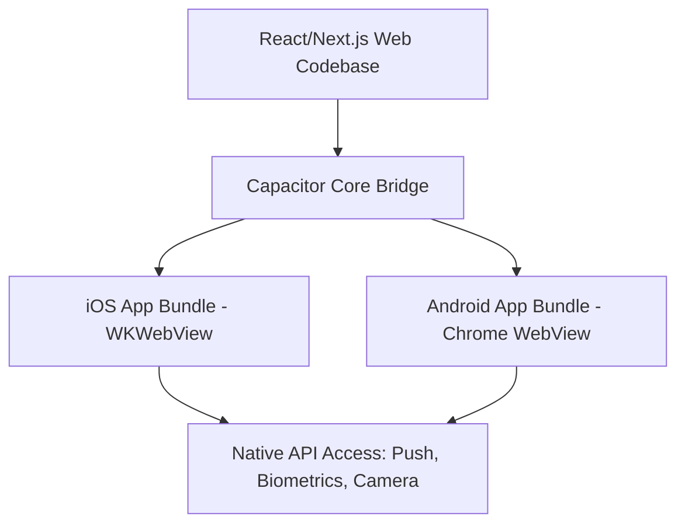

# Technical Strategy: Hybrid Mobile Application Conversion
## Transforming CareerPropel into a High-Fidelity Mobile App

This document outlines the architectural strategy, technology stack, and visual guidelines to convert **CareerPropel** from an enterprise web-native platform into a premium, hybrid mobile application (iOS & Android) featuring a native look, feel, and performance.

---

## 1. Primary Architectural Architecture: Why Capacitor?

To transition CareerPropel into a hybrid mobile application while reusing 95%+ of our existing React, TypeScript, and Tailwind CSS codebase, we select **Ionic Capacitor** over legacy frameworks like Cordova or complete rewrites like React Native.



### Key Advantages of Capacitor:
*   **Direct Native API Bridge**: Seamless access to camera, secure keychains, push notifications, and biometrics via npm modules.
*   **Modern WKWebView Shell**: Runs on high-performance native browser engines with zero overhead.
*   **Continuous Synchronization**: Built-in asset compilation allows immediate sync of web assets into native targets (`npx cap sync`).
*   **Next.js Friendly**: Works exceptionally well with Next.js compiled exports (`next export`) or dynamic web shells.

---

## 2. Hybrid UI/UX Design System (The "Mobile Native" Feel)

To ensure the web app *feels* native, we must implement custom CSS adjustments and touch-first visual elements tailored for mobile viewport bounds.

### A. Core Layout & Navigation
*   **Viewport Constraints**: Lock scrolling to vertical-only with `overscroll-behavior-y: contain` to prevent standard browser "rubber-banding."
*   **Bottom Navigation Bar (Tab Bar)**: Replace the desktop header/sidebar with a glassmorphic bottom bar featuring central action buttons:
    ```
    [ Dashboard ]  [ Kanban ]  [ (📝 Log) ]  [ Prep Workspace ]  [ Settings ]
    ```
*   **SafeArea Padding**: Leverage CSS environment variables (`env(safe-area-inset-bottom)` and `env(safe-area-inset-top)`) to prevent UI overlapping with phone notches or system taskbars.

### B. Gestures & Micro-Animations
*   **Swipe-to-Action**: Integrate touch gestures like swiping a job card left to archive or right to mark as applied.
*   **Haptic Feedback**: Trigger subtle haptic buzzes via `@capacitor/haptics` during card drops, stage transitions, or validation successes.
*   **Bottom Sheets**: Replace overlay modals with standard modern bottom sheets that slide up smoothly and are dismissed by swiping down.

---

## 3. Native Integration Checklist

| Capability | Native Plugin | Implementation & Architecture |
| :--- | :--- | :--- |
| **Authentication** | `@capacitor/preferences` + Biometrics | Store secure JWTs inside standard native Keychains/Preferences. Integrate touch/face ID for instant, seamless login. |
| **Push Alerts** | `@capacitor/push-notifications` | Push alerts for interview calendar syncs, preparation reminders, or recruiter follow-up windows. |
| **Document Export** | `@capacitor/filesystem` + Sharing | Native file writing to compile customized STAR resumes as PDFs and open standard native sharing sheets. |
| **Real-time Logs** | Native WebSockets | WebSocket connections continue executing in background shells via native thread proxies. |

---

## 4. Offline Capability & Synchronization

Mobile users demand operational continuity, even in low-connectivity zones like subways or elevators.

### Service Worker & Local Storage Layer
1.  **IndexedDB Caching**: Store candidate profiles, staged accomplishments, and job board pipelines locally inside browser IndexedDB.
2.  **Optimistic UI Updates**: Allow users to drag jobs to other stages or log accomplishments immediately. The UI updates instantly, and changes are buffered in an offline queue.
3.  **Background Synchronization**: On network recovery, a background sync service worker fires, executing the buffered REST operations in order to preserve multi-tenant integrity.

---

## 5. Execution Roadmap & Milestones

```
  Step 1: Scaffolding  ──>  Step 2: UI Optimization ──>  Step 3: Native Integration ──>  Step 4: Compilation & Distribution
  - Install Capacitor       - Bottom tab nav layout        - Push notifications setup      - Native build (.ipa / .apk)
  - Init ios/android        - Safe area constraints        - Secure keychain storage       - Deploy to App/Play Stores
```

### Step 1: Framework Scaffolding
```bash
# 1. Install Capacitor dependencies
npm install @capacitor/core @capacitor/cli

# 2. Initialize the project configuration
npx cap init CareerPropel com.careerpropel.app --web-dir=out

# 3. Add mobile target packages
npm install @capacitor/ios @capacitor/android
npx cap add ios
npx cap add android
```

### Step 2: Next.js Static Optimization
Configure `next.config.js` to build a clean static export that can be bundled locally into Capacitor web assets:
```javascript
module.exports = {
  output: 'export',
  images: {
    unoptimized: true, // WebView loads local files directly
  }
}
```

### Step 3: Run the Synchronized Build Pipeline
Every release is compiled and immediately pushed into iOS/Android wrappers:
```bash
npm run build
npx cap sync
npx cap open ios # Launches Xcode for native compilation
```

This strategy ensures CareerPropel retains its exceptional, high-fidelity premium aesthetic while delivering the responsive, offline-first experience expected of a modern native application.
