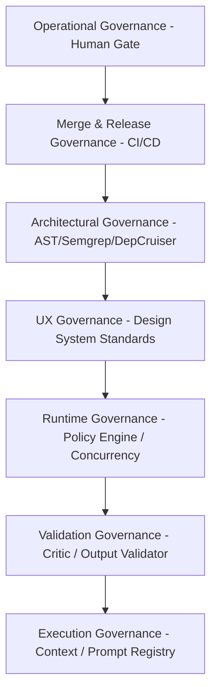
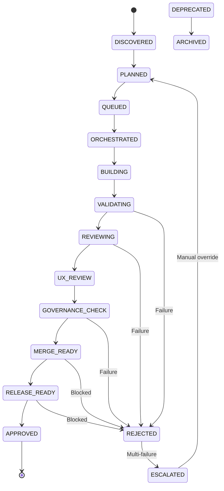

# Engineering Agent Operating System & Governance Model

This document establishes the canonical authority, unified operational hierarchy, and orchestration semantics for all engineering and product agent ecosystems running across the workspace. It governs both local development agents and production application agents.

---

## 1. Ecosystem Overview

This workspace hosts three distinct categories of agent ecosystems, plus a static repository governance enforcement layer:

1. **Local IDE Subagent Ecosystem (CLAUDE / Claude Code)**
   - **Environment:** Local IDE terminal / Claude Code interface.
   - **Form:** Markdown-based instructions with YAML configuration frontmatter.
   - **Role:** Autonomous local task execution, code generation, read-only validation, and local merge governance.
2. **Codex Local Subagent Ecosystem (CODEX)**
   - **Environment:** Local Codex adapter runtime.
   - **Form:** TOML configuration files.
   - **Role:** Local execution adapter mappings of the core builder, validator, and orchestration tools.
3. **Application Domain Agent Ecosystem (CareerPropel Runtime)**
   - **Environment:** Asynchronous BullMQ background worker runtime (`src/bin/worker.ts`) and web API runtime (`src/bin/web.ts`).
   - **Form:** Structured TypeScript declarations in `src/lib/agents/registry/AGENT_REGISTRY.ts` and prompt files.
   - **Role:** Executing user-facing career search automation tasks (e.g., resume tailoring, job matching, outreach).
4. **Static Repository Governance & Validation Pipeline**
   - **Environment:** Local pre-commit/pre-push hooks and GitHub Actions CI.
   - **Form:** Shell scripts, AST-grep templates, Semgrep configurations, and Dependency Cruiser rules.
   - **Role:** Compile check, linting, circular dependency detection, and architectural boundary checking.

---

## 2. Discovery Results

A complete recursive audit of the workspace has identified the following ecosystems, agents, and configurations:

### Discovered Ecosystems

#### Local IDE Subagent Ecosystem (CLAUDE)
- **Location:** `.claude/agents/`
- **Purpose:** Development automation loop (plan, build, validate, merge, deploy).
- **Environment:** Claude Code / IDE context.
- **Agent Types:** Builder Agent, Validator Agent, Orchestrator Agent, Merge Agent, Test Strategy Agent, Deployment Governor Agent.
- **Governance Model:** Bounded max turns, local validation script hooks (`PostToolUse`, `Stop`).
- **Execution Style:** Sequential execution, interactive shell loops.
- **Validation Style:** Shell scripts running compile, lint, and typechecks.
- **Orchestration Model:** Builder-validator feedback loop managed by `validation-orchestrator`.
- **Dependencies:** jq, npm scripts (lint, typecheck).
- **Overlap Risks:** Overlap with Codex TOML configurations; instruction drift between Markdown and TOML.
- **Maturity:** High (actively integrated with local developer workflows).
- **Consolidation Risk:** Moderate (requires keeping Markdown and TOML definitions in sync).

#### Codex Local Subagent Ecosystem (CODEX)
- **Location:** `.codex/agents/`
- **Purpose:** Adapter definitions for Codex execution runner.
- **Environment:** Codex agent execution adapter.
- **Agent Types:** Builder Agent, Validator Agent, Orchestrator Agent, Test Strategy Agent, Deployment Governor Agent.
- **Governance Model:** Bounded instructions, read-only constraints for validator.
- **Execution Style:** Non-interactive local runs.
- **Validation Style:** External validation loops.
- **Orchestration Model:** Builder-validator loop.
- **Dependencies:** Local Codex engine.
- **Overlap Risks:** High overlap with CLAUDE markdown instructions.
- **Maturity:** Moderate (subset replication of CLAUDE agents).
- **Consolidation Risk:** High (risk of instruction divergence unless consolidated/synchronized).

#### Application Domain Agent Ecosystem (CareerPropel Runtime)
- **Location:** `src/lib/agents/`
- **Purpose:** User-facing product execution.
- **Environment:** Node.js, BullMQ, Redis, PostgreSQL (Prisma).
- **Agent Types:** 12 specialized domain agents, 1 Meta-Planner, 1 Critic Agent.
- **Governance Model:** Centralized policy engine (`policyEngine.ts`), prompt registry (`promptRegistry.ts`), and output validator (`outputValidator.ts`).
- **Execution Style:** Asynchronous queued executions with priority weights.
- **Validation Style:** Multi-pass schema, semantic, and Critic threshold checks (0-10 scoring).
- **Orchestration Model:** Stage-Trigger Map (`stageTriggerMap.ts`) and Meta-Planner dynamic coordination.
- **Dependencies:** BullMQ, PostgreSQL, Redis, Anthropic SDK, NVIDIA NIM.
- **Overlap Risks:** Low overlap with development agents, but requires strict boundary mapping so test runner tools do not leak into production.
- **Maturity:** Production-grade.
- **Consolidation Risk:** Low (highly decoupled from dev tooling).

#### Static Repository Governance System
- **Location:** `scripts/`, `.github/workflows/`, `.semgrep/`, `.dependency-cruiser/`
- **Purpose:** Static verification and gatekeeper checks.
- **Environment:** GitHub Actions / local terminal.
- **Agent Types:** CI Agent, Validator Agent, Audit Agent.
- **Governance Model:** Strict AST and boundary checks blocking merge on error.
- **Execution Style:** Script-based static analysis.
- **Validation Style:** AST-grep, Semgrep, Dependency Cruiser, Madge, Jest.
- **Orchestration Model:** GitHub Workflow sequence.
- **Dependencies:** ast-grep, semgrep, dependency-cruiser, madge, Jest.
- **Overlap Risks:** None; acts as the primary gatekeeper for all code changes.
- **Maturity:** High.
- **Consolidation Risk:** Low.

---

## 3. Canonical Taxonomy

To eliminate semantic drift, all ecosystems must align on these standard definitions:

- **Orchestration Layer:** The component coordinating sequences of specialized operations (e.g., `validation-orchestrator` in dev, `AgentOrchestrator` in runtime).
- **Builder Agent:** An agent responsible for writing, updating, or generating code/content (e.g., `code-builder`).
- **Validator Agent:** A read-only agent verifying correct behavior or compliance without modifying assets (e.g., `code-validator`).
- **Governance Agent / Model:** Enforces security, cost, rate limits, structural constraints, and deployment readiness on execution (e.g., `merge-governor`, `deployment-governor`, `policyEngine.ts`).
- **Critic Agent:** An auditor scoring output quality against qualitative thresholds (e.g., Critic meta-agent).
- **Skill:** A modular, reusable capability or CLI rulebook injected into agent contexts (e.g., `gitnexus`, `ui-ux-pro-max`).

---

## 4. Environment Responsibilities

Each workspace environment holds designated authority:

| Environment | Primary Responsibility | Authorized Tooling / Execution |
|---|---|---|
| **Claude (IDE)** | Reason-level orchestration | Subagent coordination, planning, interactive coding assistance |
| **Codex** | Local execution adapters | TOML-configured local execution mappings |
| **Skills** | Reusable capabilities | Injected markdown guides (e.g., `.agents/skills/`) |
| **GitHub Workflows** | CI/CD governance | Compilation, linting, circular dependency checks, security reviews |
| **Cursor / VSCode** | Interactive workspace | Local workspace editing, lint-on-save, and debug runners |
| **Worker (Runtime)** | Asynchronous domain execution | Async task queue processors (BullMQ) |
| **Web (Runtime)** | Synchronous light operations | Telemetry collection, Server-Sent Events, queue management |

---

## 5. Governance Hierarchy

Governance is organized hierarchically to enforce safety boundaries. Higher layers override and block lower layers:



1. **Operational Governance:** Ultimate authority; human operator decisions, manual overrides, and approval flags.
2. **Merge & Release Governance:** Enforced by GitHub branch protection and `scripts/governance/spec-check.js`. Prevents modifications to protected branches without ADRs/specs and a green CI run.
3. **Architectural Governance:** Rules enforcing clean system boundaries (e.g., no worker imports in web runtime, no test imports in source code), checked by `ast-grep` and `dependency-cruiser`.
4. **UX Governance:** Guidelines from `ui-ux-pro-max` ensuring design consistency (no emojis as icons, no layout shifts, proper cursors).
5. **Runtime Governance:** In-app policies like cost ceilings, API key encryption, and concurrency limits managed by `src/lib/governance/policyEngine.ts`.
6. **Validation Governance:** Independent scoring (Critic agent) and Zod schema validations on outputs.
7. **Execution Governance:** Bounded turn limits, prompt sanitizer constraints, and context chunk limits.

---

## 6. Validation Hierarchy

Validation flows bottom-up to catch errors as early as possible:

1. **Layer 1: Structural Syntax & Compile Checks (Fast Failure)**
   - Linting (`eslint`), typescript compile (`tsc --noEmit`), and file-specific validations in `validate-after-edit.sh`.
2. **Layer 2: Local Schema & Unit Validation**
   - Zod schema parsing and Jest unit tests.
3. **Layer 3: System Boundaries & Static Rules**
   - Circular dependency analysis (Madge) and dependency boundaries (Dependency Cruiser).
4. **Layer 4: Qualitative Critic Assessment**
   - Critic Agent evaluating output readability, accuracy, and format completeness against threshold scores.
5. **Layer 5: Continuous Pre-Merge Check**
   - PR link verification (spec checks for database/API/security changes).

---

## 7. Execution Pipeline

All code modifications and task executions must flow through this canonical sequence:

```text
Request (natural language or trigger)
  → Planning (decomposition & dependency mapping)
  → Orchestration (task allocation to agents)
  → Skill Selection (injecting relevant guidelines e.g. ui-ux-pro-max)
  → Builder Execution (generating diffs or outputs)
  → Validation (lint, compile, schema parse)
  → Review (Critic analysis or code reviewer subagent)
  → UX Validation (compliance with design specs)
  → Governance Validation (cost limit checks, boundary audits)
  → Merge Validation (spec check, circular dep checks)
  → Release Validation (smoke tests, release candidate compilation)
  → Approval (Human sign-off or deployment merge)
```

### Concern Ownership Matrix

| Concern | Canonical Owner | Enforcement Mechanism |
|---|---|---|
| **Planning** | Planning agents | Planner meta-agent / task decomposer |
| **Orchestration** | Orchestrator agents | `validation-orchestrator` / `AgentOrchestrator` |
| **Code Generation** | Builder agents | `code-builder` / backend & frontend specialists |
| **Correctness** | Validator agents | `code-validator` / Jest / Zod / compiler |
| **Validation Strategy** | Test Strategy Agent | `test-strategy.toml` execution and plan verification |
| **Architecture** | Governance agents | `merge-governor` / `dependency-cruiser` / `ast-grep` |
| **Usability** | UX agents | Critic agent / `ui-ux-pro-max` checklist |
| **Merge Safety** | Merge agents | `spec-check.js` / branch protections |
| **Release Safety** | Release agents | `RELEASE_GOVERNANCE.md` validation suite / CI |
| **Deployment Governance** | Deployment Governor Agent | `deployment-governor` / release validation and authorization checks |

---

## 8. Orchestration Semantics

Orchestration behaves deterministically under these rules:

- **Mandatory Stages:** Planning, Builder Execution, Validation, Review.
- **Optional Stages:** UX Validation (skipped if no UI files changed), Release Validation (skipped for non-release branches).
- **Stop Conditions:** Any validation failure (Layer 1-3), Critic score below threshold, or security vulnerability discovery immediately stops execution.
- **Retry Semantics:** Builder-Validator loop capped at 3 attempts. In-app agent runtime uses exponential backoff (max 3-5 retries depending on task priority).
- **Rollback Conditions:** If a step fails validation or deadlocks, the orchestrator triggers transactional revert (reverting files to git HEAD in development, or updating DB execution state to `failed` and executing fallback logic in production).

---

## 9. Lifecycle Semantics

All agents and tasks transition through defined, trace-logged states:

### Unified States



- `DISCOVERED`: Task identified or triggered.
- `PLANNED`: Task decomposed into dependencies and subtasks.
- `QUEUED`: Placed in execution queue (BullMQ or local stack).
- `ORCHESTRATED`: Assigned to specific agents.
- `BUILDING`: Builder agent generating output/code.
- `VALIDATING`: Syntax, compile, and schema checks running.
- `REVIEWING`: Critic/reviewer scoring output.
- `UX_REVIEW`: Evaluating against design standards.
- `GOVERNANCE_CHECK`: Cost, security, and runtime constraints checks.
- `MERGE_READY`: Static CI/CD and spec checks green.
- `RELEASE_READY`: Smoke tests passed, deployment candidate built.
- `APPROVED`: Merged/deployed.
- `REJECTED`: Fails validation or review.
- `ESCALATED`: Hard stop, requires developer intervention.
- `DEPRECATED` / `ARCHIVED`: Legacy configurations/agents deactivated.

### Transition Rules
- **No Skip Transitions:** Code cannot go from `BUILDING` directly to `MERGE_READY` without passing `VALIDATING` and `REVIEWING`.
- **Escalation Trigger:** If a task loops in `REJECTED` 3 times, it transitions to `ESCALATED`.
- **Rollback Trigger:** Transitioning to `REJECTED` from a `BUILDING` state rolls back all workspace edits to the last clean checkpoint.

---

## 10. Shared Instruction Strategy

To prevent semantic drift, duplicate instructions across `.claude/` and `.codex/` are governed by these rules:

1. **Shared Terminology:** Terms like "validation-orchestrator", "code-builder", and "code-validator" are preserved across both ecosystems.
2. **Directory Structure Alignment:**
   - Any new instructions or shared guidelines are organized under:
     - `shared/governance/` (rules for cost and rate limits)
     - `shared/validation/` (lint, compile, test commands)
     - `shared/architecture/` (layer boundaries)
     - `shared/ux/` (design system tokens)
     - `shared/merge/` (PR template guidelines)
3. **Synchronization:** The TOML definitions in `.codex/agents/` are kept structurally identical to the markdown instructions in `.claude/agents/`. Any updates must be applied to both simultaneously.

---

## 11. Merge Governance

Merge safety is enforced programmatically prior to integrating code:

- **Protected Modules:** `prisma/schema.prisma`, `src/lib/security/`, `src/lib/llm/`, `src/lib/agents/`.
- **Pre-Merge Validation:**
  - AST-grep scan must confirm no deprecated imports.
  - Madge circular check must return 0 cycles.
  - Dependency Cruiser must verify web-worker boundaries.
  - `spec-check.js` must verify associated ADRs or design specs for changes in protected modules.
- **Rollback:** If a merged branch breaks staging metrics, automatic Git revert is triggered.

---

## 12. Release Governance

Release criteria are defined in `RELEASE_GOVERNANCE.md`:

- **Execution:** Release candidates are compiled via `npm run build`.
- **Smoke Tests:** Must pass `npm run test:smoke`.
- **Verification:** Worker Redis heartbeat checks are verified.
- **Autonomy:** Production deployment requires manual operator authentication.

---

## 13. Conflict Resolution & Precedence Rules

- **Validator Disagreements:** If a validator agent flags an issue that the builder disputes, the compile check and tests are the source of truth. If tests pass but the validator highlights an architectural risk, execution halts and escalates to a human.
- **Governance vs UX Conflicts:** Governance overrides UX. If a rich UI animation violates performance budgets or token sizes, it is simplified.
- **Merge vs Release Conflicts:** Release branch freezes override merge requests. No features are merged into release branches during stabilization.
- **Orchestration Deadlocks:** If agent dependencies form a cycle (e.g., Agent A waits for Agent B which waits for Agent A), the orchestrator triggers a deadlock timeout, aborts the task, and escalates.
- **Recursive Review Escalation:** Reviewers are prohibited from requesting changes recursively. If feedback is not resolved within 2 loops, a human must adjudicate.

---

## 14. Extensibility Rules

- **Adding New Agents:** Must define a unique agent configuration matching the schema in `AGENT_REGISTRY.ts`, specify model fallback configurations, and configure a Critic threshold.
- **Adding Skills:** Skills must be documented in a `SKILL.md` file within a dedicated directory under `.agents/skills/` or `.claude/skills/`.
- **Adding CI Gates:** Must be added to `.github/workflows/ci.yml` and verified locally by expanding `npm run governance:full`.

---

## 15. Anti-Patterns

- **Duplicate Orchestration:** Spawning an ad-hoc coordination script when `AgentOrchestrator` or `validation-orchestrator` is available.
- **Circular Agent Chains:** Chaining product agents where output loops back to the input of a previous step without terminal bounds.
- **Production Test Contamination:** Importing mock LLM configurations or test packages into production files without `NODE_ENV === 'test'` guards.
- **Spec Bypass:** Committing schema changes without matching markdown ADRs in `docs/adr/`.

---

## 16. Future Governance Rules

- **Dynamic Token Budgets:** Automatically scaling token budgets based on real-time API latency and cost metrics.
- **Automated Dependency Graph Refactoring:** An agent that periodically refactors circular imports using AST-grep.
- **KMS Secret Integration:** Migrating all BYOK settings from local AES encryption to an enterprise Key Management Service (KMS).
