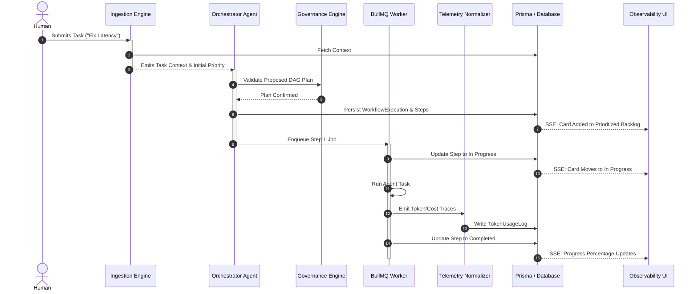

# Orchestration Architecture (docs/orchestration/ARCHITECTURE.md)

This document maps out the high-level boundaries and interfaces of the Autonomous Multi-Agent Orchestration module.

---

## 1. High-Level Modular Decoupling

The module is strictly separated into four decoupled layers to ensure portability:

```
+---------------------------------------------------------------------------------+
|                               VISUALIZATION LAYER                               |
|        Trello Swimlane UI Component / Glass Cockpit Observability Dash          |
+---------------------------------------+-----------------------------------------+
                                        | (Standard Event / State Protocol)
                                        v
+---------------------------------------+-----------------------------------------+
|                               ORCHESTRATION CORE                                |
|            DAG Parser   -   Task Ingestion Engine   -   State Machine           |
+---+-----------------------------------+-------------------------------------+---+
    |                                   |                                     |
    v                                   v                                     v
+---+----------------+         +--------+-------+         +-------------------+---+
| AGENT ADAPTER      |         | EVENT BUS      |         | TELEMETRY ADAPTER |   |
| Decouples Claude/  |         | Abstract pub/  |         | Normalizes logs & |   |
| MCP executions.    |         | sub transport  |         | token costs to the|   |
| Exposes standard   |         | (Redis, In-    |         | database layout.  |   |
| capability formats.|         | Memory, SSE).  |         |                   |   |
+--------------------+         +----------------+         +-------------------+---+
```

### Module Interfaces

#### A. Ingestion Engine
Responsible for expanding user intentions and constructing the base execution context:
```typescript
interface IngestionResult {
  title: string;
  expandedContext: string;
  domain: 'codebase' | 'profile' | 'research' | 'interview';
  predictedComplexity: 'low' | 'medium' | 'high';
  estimatedCostUsd: number;
  initialPriorityScore: number;
}
```

#### B. Orchestrator Engine (Arbitrator)
Manages the dynamic step allocation and DAG progression:
```typescript
interface OrchestratorCore {
  initializeWorkflow(context: IngestionResult): Promise<string>;
  advanceStep(workflowId: string, completedStepKey: string, stepOutput: any): Promise<void>;
  haltWorkflow(workflowId: string, reason: string): Promise<void>;
}
```

#### C. Governance Engine
Ensures safety constraints are met before step transitions:
```typescript
interface GovernanceEngine {
  validateStepApproval(step: WorkflowStepDefinition, payload: any): Promise<boolean>;
  validateCostLimits(workflowId: string): Promise<boolean>;
  sanitizeAgentInput(prompt: string): string;
}
```

---

## 2. In-Depth Component Interactions


