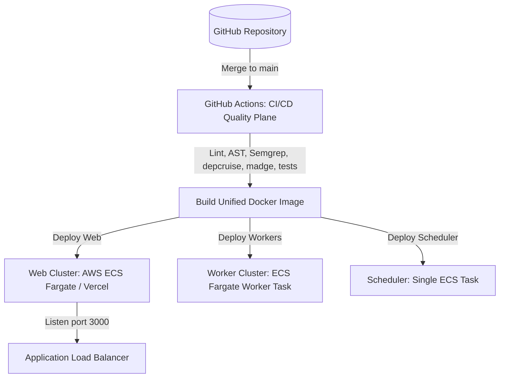

# Deployment Flow

This document details the multi-runtime deployment topology of the CareerPropel modular monolith codebase.

---

## Build and Deployment Target Routing



---

## Production Entrypoint Scripts

- **Web Container Runtime Command**:
  ```bash
  npm run start:web
  ```
- **Worker Container Runtime Command**:
  ```bash
  npm run start:worker
  ```
- **Scheduler Container Runtime Command**:
  ```bash
  npm run start:scheduler
  ```
