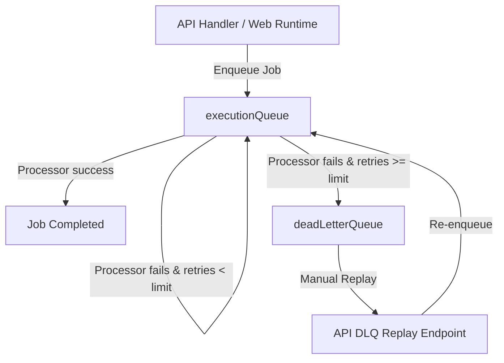

# Queue Topology

This document details the BullMQ queue structure and message flow inside the CareerPropel background execution plane.

---

## Active Queues

1. **`executionQueue`**: Main queue where job application tasks are enqueued.
2. **`deadLetterQueue`**: DLQ where failed jobs are promoted after reaching retry limits.
3. **Domain Queues**: Domain-specific queues managed under `src/domains/networking/workers/`.

---

## Message Routing Flow

