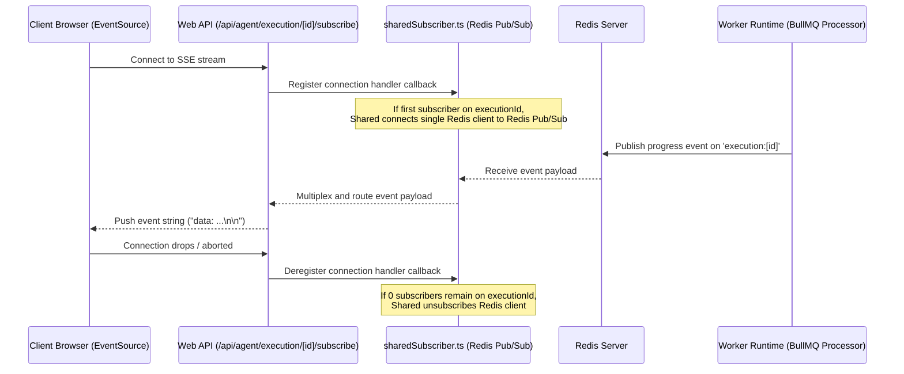

# Realtime Event Flow (SSE)

This document maps the real-time event pipeline from BullMQ worker progress updates to client browsers.

---

## SSE Event Stream Pipeline

```mermaid
sequenceDiagram
    participant Browser as Client Browser (EventSource)
    participant API as Web API (/api/agent/execution/[id]/subscribe)
    participant Shared as sharedSubscriber.ts (Redis Pub/Sub)
    participant Redis as Redis Server
    participant Worker as Worker Runtime (BullMQ Processor)
    
    Browser->>API: Connect to SSE stream
    API->>Shared: Register connection handler callback
    Note over Shared: If first subscriber on executionId,<br/>Shared connects single Redis client to Redis Pub/Sub
    
    Worker->>Redis: Publish progress event on 'execution:[id]'
    Redis-->>Shared: Receive event payload
    Shared-->>API: Multiplex and route event payload
    API-->>Browser: Push event string ("data: ...\n\n")
    
    Browser->>API: Connection drops / aborted
    API->>Shared: Deregister connection handler callback
    Note over Shared: If 0 subscribers remain on executionId,<br/>Shared unsubscribes Redis client
```
