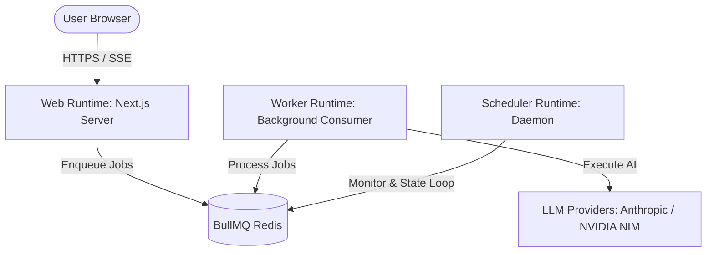

# Runtime Topology

This document maps the process boundaries and active runtimes of the CareerPropel application.

---

## Process Boundaries

| Runtime | Entrypoint | Process Type | Primary Duty | Concurrency / Scaling |
|---|---|---|---|---|
| **Web** | `src/bin/web.ts` | Next.js Server | Serve pages, REST APIs, and multiplex SSE | Horizontally scale behind load balancer |
| **Worker** | `src/bin/worker.ts` | Node.js Worker | Execute BullMQ processors, call LLMs, run domain tasks | Scale based on queue backlogs |
| **Scheduler** | `src/bin/scheduler.ts` | Node.js Daemon | Transition delayed/stalled jobs in BullMQ | Single active replica (active-passive) |
