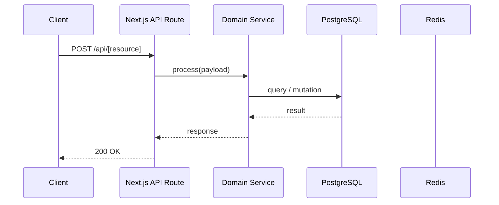

# Technical Design Spec: [Feature / System Name]

**Status**: Draft | In Review | Approved | Implemented  
**Spec ID**: TECH-[number]  
**Owner**: [Name]  
**Product Spec**: [SPEC-number or N/A]  
**Created**: YYYY-MM-DD  
**Last Updated**: YYYY-MM-DD

---

## System Context

<!-- Where does this fit in the overall architecture?
     Describe the component boundary, its callers, and its dependencies. -->

```
[Caller] → [This Component] → [Downstream Dependencies]
```

## Sequence Diagram

<!-- Describe the primary happy-path flow using a Mermaid sequence diagram. -->



## Data Flow

<!-- Describe how data moves through the system.
     Include transformations, validations, and persistence points. -->

1. Input received at `[entry point]`
2. Validated by `[schema/zod]`
3. Processed by `[service]`
4. Persisted to `[table(s)]`
5. Response shaped by `[serializer/response helper]`

## Domain Boundaries

<!-- What domain owns this feature? What are the explicit boundaries? -->

- **Owning domain**: `src/domains/[domain]/`
- **Shared services used**: `src/lib/[service]`
- **External services**: [List any third-party APIs]

## API Contract Summary

<!-- High-level contract — link to full API contract spec if needed. -->

| Method | Route | Auth Required | Request Body | Response |
|---|---|---|---|---|
| `POST` | `/api/[resource]` | Yes | `{ field: type }` | `{ data: {} }` |

## Database Schema Changes

<!-- List new tables, columns, indexes, or constraints.
     Full migration must accompany implementation. -->

```prisma
// New model or field additions
model [ModelName] {
  id        String   @id @default(cuid())
  // ...
}
```

**Migration strategy**: [Additive / Destructive / Backfill required]

## Dependency Impact

<!-- What existing code paths are affected by this change? -->

| Component | Change Type | Risk |
|---|---|---|
| `src/lib/[file]` | [Modified / New dependency] | [High/Med/Low] |

## Security Considerations

- **Authentication**: [How is the user identity verified?]
- **Authorization**: [RBAC / ownership check approach]
- **Input validation**: [What is validated at the boundary?]
- **Data sensitivity**: [Does this touch PII or sensitive data?]
- **Injection risk**: [SQL, prompt, XSS considerations]

## Scalability Analysis

- **Expected request volume**: [req/day or req/min]
- **Database query complexity**: [O(1) / O(n) / indexed?]
- **Cache strategy**: [What is cached, TTL, invalidation]
- **Background processing**: [Queue-based or synchronous?]

## Failure Modes

| Failure Scenario | Detection | Recovery |
|---|---|---|
| DB unavailable | HTTP 503 response | Retry with backoff |
| Redis unreachable | Structured log warn | Fail-open / degrade gracefully |
| External API timeout | Timeout error | Fallback or queue |

## Observability Requirements

- **Logs**: Structured pino logs at entry/exit with `correlationId`, `userId`
- **Metrics**: [List any new counters, histograms, or gauges]
- **Alerts**: [Conditions that should page on-call]
- **Tracing**: [Trace context propagated? Span names?]

## Rollback Strategy

<!-- How do we safely revert if this causes production issues? -->

1. [Step 1: e.g., disable feature flag]
2. [Step 2: e.g., run rollback migration]
3. [Step 3: e.g., redeploy previous build]

## Implementation Checklist

- [ ] Database migration written and reviewed
- [ ] API route with auth + ownership check
- [ ] Zod validation schema
- [ ] Unit tests for domain service
- [ ] Integration tests for API route
- [ ] Error states logged with structured context
- [ ] `.env.example` updated for new env vars
- [ ] Operational readiness review completed
